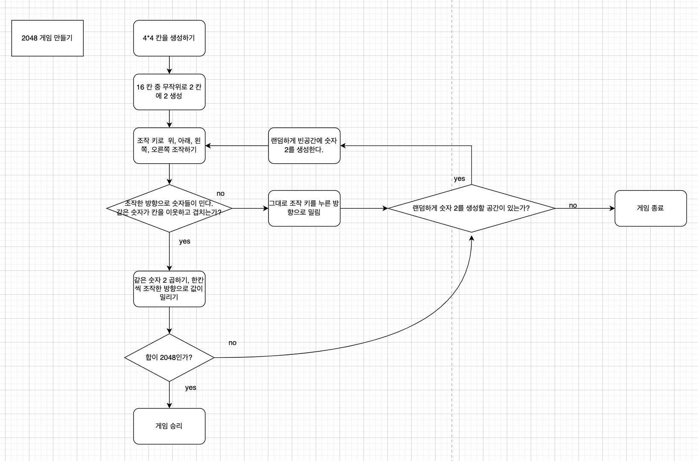
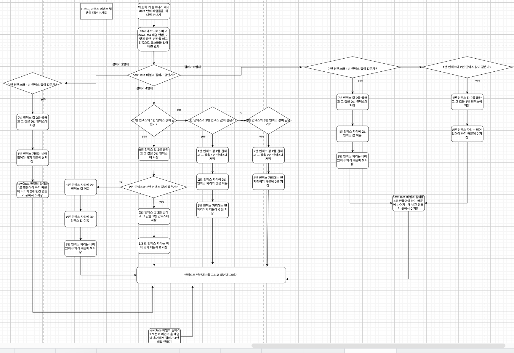
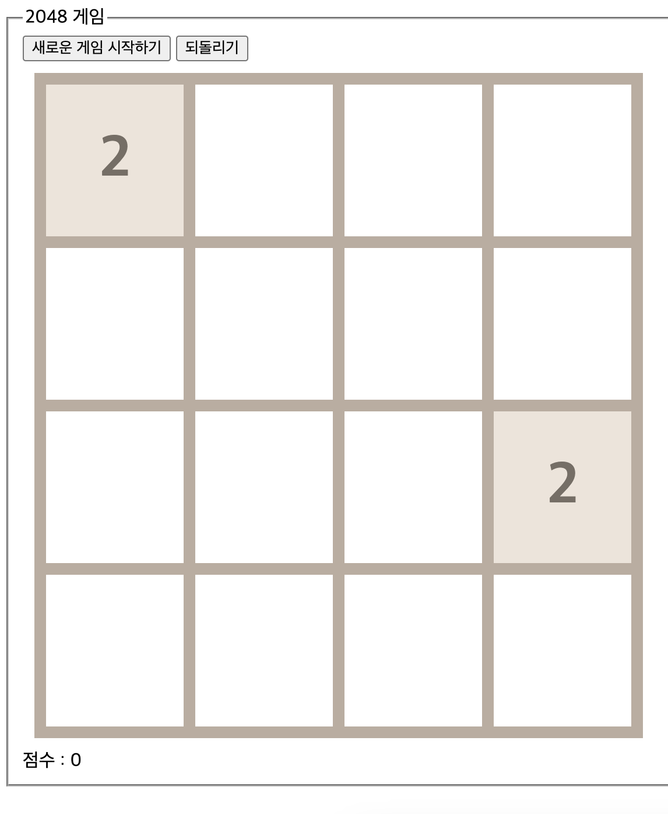
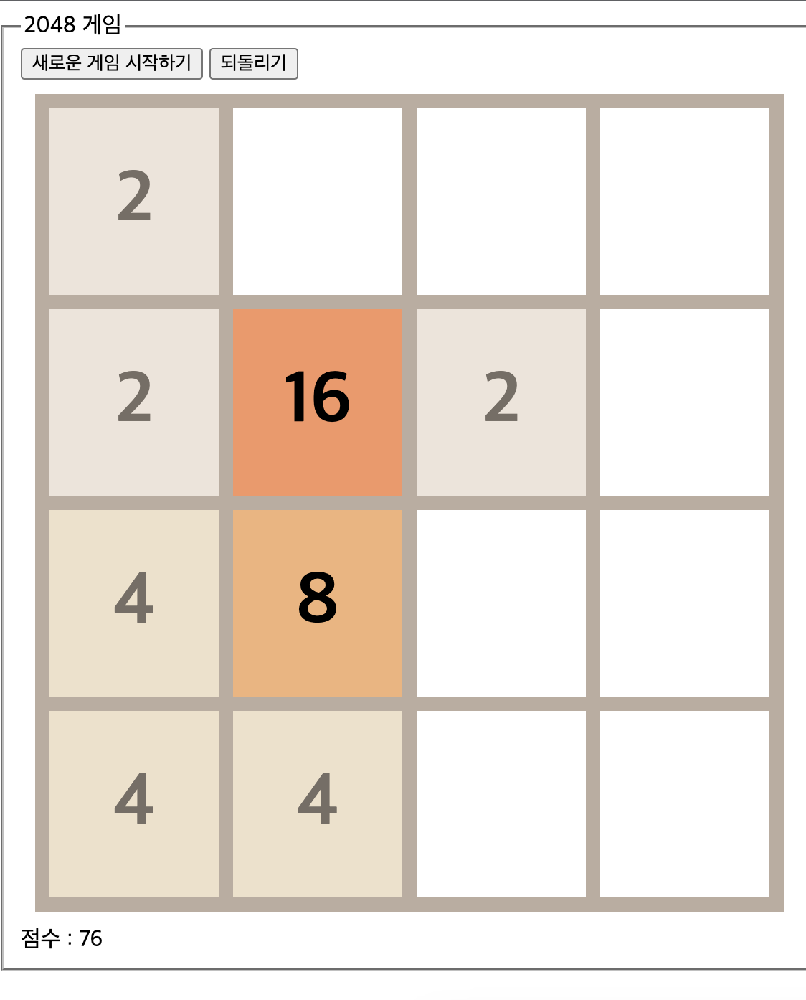
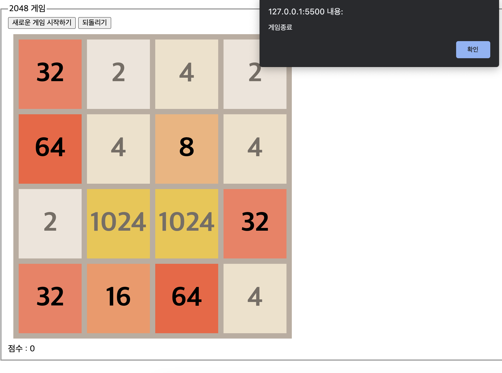
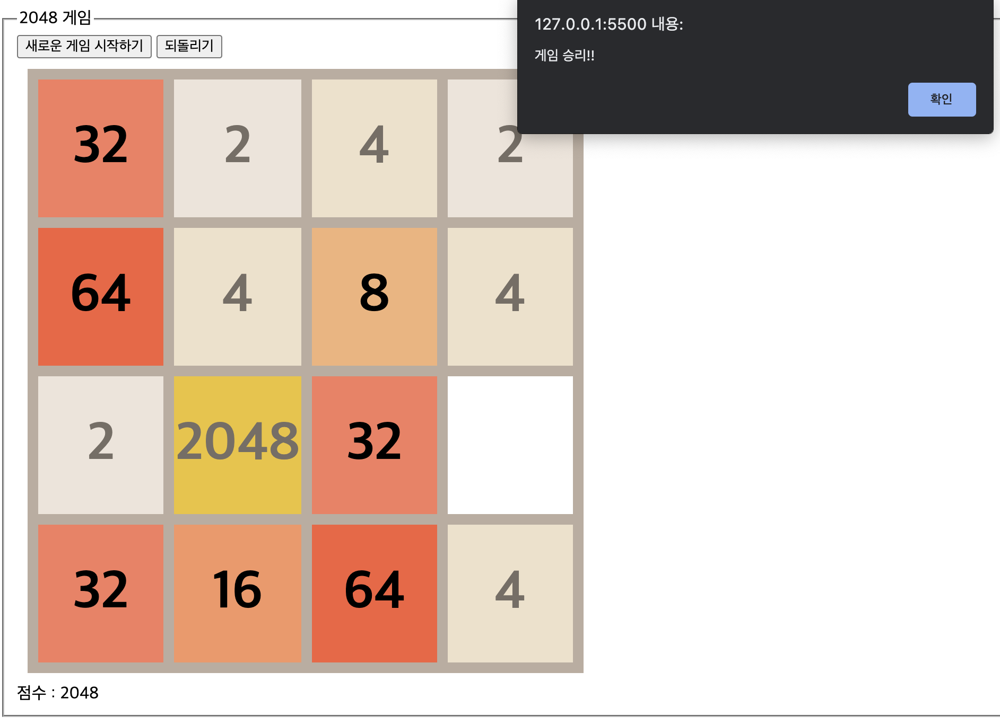
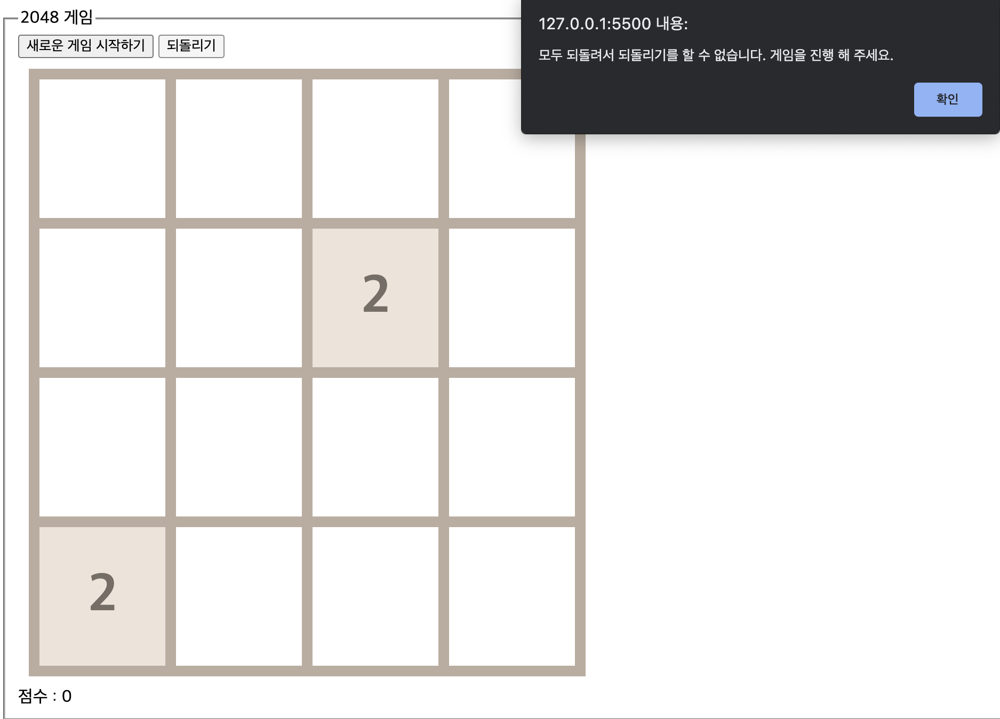
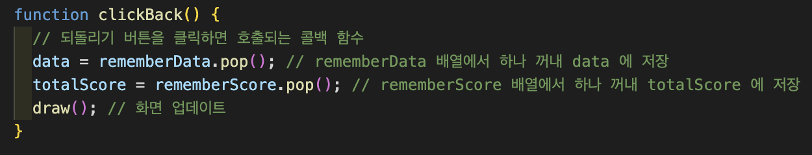
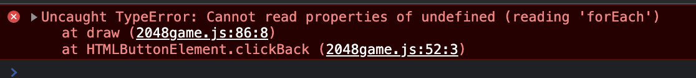
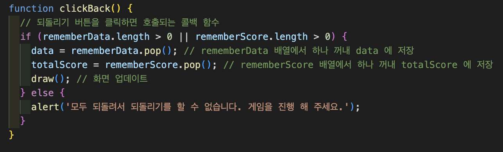

# 2048 게임

 2048 게임은 방향키로 숫자들을 방향키를 누른 방향으로 밀어서 정렬하고 숫자들을 밀때 인접한 칸에 같은 숫자가 있다면 하나로 합쳐서 숫자가 밀려 정렬되며 2048 숫자를 만들면 이기는 게임 입니다.

# 2048 게임을 만들면서 어려운점

 방향키에 따라서 왼쪽,오른쪽 방향은 같은 행의 칸들의 값들을 누른 방향으로 밀고 위쪽, 아래쪽 방향은 같은 열의 값들을 누른 방향으로 밀어 정렬하는데 이웃한 칸의 값이 같다면 값을 더하는것을 구현해야 했습니다. 이때 어려움을 겪었던 것은  
1. 게임의 데이터를 2차원 배열로 관리하는데 왼쪽, 오른쪽 방향은 그래도 같은 배열 안에서 한쪽으로 정렬하면 되는데 위쪽, 아래쪽 방향은 각각의 배열의 같은 인덱스 자리를 위, 아래 방향으로 밀어 정렬하는 것이기 때문에 어떻게 구현해야 할지 어려움이 많았습니다.  
2. 왼쪽,오른쪽,위쪽, 아래쪽 방향으로 값을 밀어 정렬할때 그 방향의 끝에서부터 인접하는 두 칸의 값이 같다면 두 값을 합치고 하나의 칸으로 저장 후 뒤에 칸들의 값을 누른 방향으로 밀어 정렬하는것이 어려운것이 한번 인접한 칸의 값이 같아서 합쳐진 칸은 한번의 이벤트에서는 다시 뒤의 칸과 값이 같다고 해서 연산이 일어나면 안되기 때문에 이런 상황들을 고려해서 구현하는것이 쉽지 않았습니다.  
3. 이러한 연산들을 data 와 화면을 동시에 계속 일치하도록 바꾸는것이 어려웠습니다. 

# 2048 게임 순서도

# 키보드 또는 마우스 이벤트에 대한 순서도

# 게임 실행 화면

## 게임 처음 시작 화면

## 게임 진행 화면

## 테스트 데이터를 이용해 게임 종료가 잘 되는지 확인하는 화면

## 테스트 데이터를 이용해 게임 승리가 잘 되는지 확인하는 화면

## 되돌리기를 계속 사용해서 이전 데이터를 기억하는 배열의 길이가 0 이라면 화면에 보여주는 메세지 화면

# 2048 게임을 만들면서 생성한 함수들 간단하게 설명

1. gameStart() : 게임을 시작할때 호출하는 함수 입니다. tr,td 태그 생성과 data 배열 요소 0 으로 초기화, 그리고 랜덤으로 2개의 빈칸에 2를 생성, data 배열에 저장되어 있는 정보를 화면에 그려 줍니다.  
2. clickRestart()  : 새로운 게임 다시 시작하기 버튼을 클릭하면 호출되는 콜백 함수 입니다. 모든 변수 값들을 초기화 하고 gameStart() 함수를 호출하여 게임을 다시 시작 합니다.  
3. clickBack() :  되돌리기 기능을 클릭했을때 호출되는 콜백 함수 입니다. rememberData , rememberScore 배열에서 하나 꺼내 현재 data, totalScore 변수에 저장하여 draw() 함수를 호출하여 화면에 다시 그립니다.  
4. randomCreateTwo() : 빈칸에 랜덤으로 2를 생성하는 함수 입니다. 빈칸을 찾아 빈칸의 칸 중에서 랜덤으로 2를 생성하는 함수이며 만약 빈칸이 없다면 게임 종료 됩니다.  
5. draw() : 데이터의 정보를 화면에 그리는 함수 입니다.  
6. upAndLeftSort(newData) : 위,왼쪽 키 이벤트 발생했을때 호출하는 함수 입니다. newData 배열을 인자로 전달 받아 연산 후 newData 를 반환 하는 함수 입니다.  
7. downAndRightSort(newData) : 아래,오른쪽 이벤트 발생했을떄 호출하는 함수 입니다. newData 배열을 인자로 전달 받아 연산 후 newData 를 반환 하는 함수 입니다.  
8. moveCells(direction) : 인자로 넘겨 받은 direction 값에 따라서 연산하고 화면에 변경된 data 배열의 데이터를 그리고 빈칸 중에서 랜덤으로 2 를 그리는 함수 입니다.  
9. checkKey(event) : 방향키를 누르면 호출되는 콜백 함수 입니다. 어떤 방향키를 눌렀는지 판단하여 moveCells() 함수를 호출 합니다.  

# 2048 게임을 만들면서 배운 지식

## documentFragment

 실무에서는 createElement 로 태그를 생성해서 바로 추가하지 않습니다. 성능에 영향을 주기 때문입니다. fragment 를 사용하면 딱 한번만 태그에 추가해주면 성능이 매우 좋아 집니다. table 태그에 추가할 태그들을 document.createDocumentFragment 메서드로 메모리 안에서만 존재하는 documentFragment 를 만들고 documentFragment 안에 필요한 태그들을 추가한뒤 마지막에 table 태그에 추가 합니다. 이때 documentFragment 는 사라집니다.
 fragment 는 화면에 그리지는 않고 메모리에만 저장 됩니다.

## 키보드 이벤트

대표적인 키보드 이벤트에는 keydown 과 keyup 이 있습니다. 키보드를 누를 때와 눌렀다 뗼 때 이벤트가 발생 합니다. 어떤 키를 눌렀는지는 event.key 속성에 나옵니다. 왼쪽 키는 ArrowLeft,오른쪽키는 ArrowRight,위쪽키는 ArrowUp,아래쪽키는 ArrowDown 으로 어떤 키를 눌렀는지 구분할 수 있습니다. 또 다른 키보드 이벤트로는 event.ctrlKet(Ctrl 키), event.altKey(Alt 키), event.shiftKey(Shift 키) , event.metaKey(Win 키) 속성도 제공 합니다.

## 마우스 이벤트

대표적인 마우스 이벤트에는 mousedown, mouseup, mousemove 가 있습니다. 각각 마우스를 클릭할 때와 클릭했다가 뗼 때 마우스를 이동할 떄 호출 됩니다.   마우스 이벤트의 속성에서 x, y 좌표를 얻을 수 있으며 이를 이용해 마우스 위치의 변화를 잡아내 마우스가 어떤 방향으로 움직이는지 알 수 있습니다.  
1. clientX, clientY 는 현재 브라우저 페이지 내에서의 x,y 좌표를 가리킵니다. 단위는 픽셀단위 입니다.  
2. pageX, pageY 도 브라우저 페이지 내에서의 x,y 좌표를 가리키지만, 스크롤이 있는 겨우 스크롤한 픽셀 값까지 포함 합니다.  
3. offsetX, offsetY 는 이벤트를 연결한 대상을 기준으로 마우스의 x,y 좌표를 가져옵니다.  
4. screenX, screenY 는 모니터를 기준으로 값이 정해지며 모니터의 왼쪽 모서리가 0 이 됩니다.  
5. movementX, movementY 는 지난 mousemove 이벤트와 비교해 얼마나 마우스를 움직였는지 표시하므로 mousemove 이벤트인 경우에만 실제 값이 잡힙니다.

# 되돌리기 기능 추가하기

 저의 아이디어는 키보드 이벤트가 호출되어 값들이 키보드 방향으로 밀리고 정렬되고 이런 연산에 들어가기 전에 data 배열을 새로운 배열을 생성해 복사해서 저장해 두었다가 되돌리기 기능을 사용하면 복사해둔 배열을 data 배열에 다시 꺼내서 사용하는 방식 입니다. 

## 되돌리기 기능을 구현할때

 moveCells 함수가 호출되서 누른 방향키에 따른 연산을 수행하기 전 data 를 rememberData 배열에 저장할때 data 를 얕은 복사를 한다면 data 배열의 데이터가 변경될때 모두 같이 업데이트 됩니다. JSON.parse(JSON.stringify(data) 를 사용하여 깊은 복사를 해서 모든 data 배열의 데이터를 기억할 수 있습니다. 

## 되돌리기 기능을 구현하면서 발생한 에러

 저는 되돌리기 버튼을 클릭하면 호출되는 콜백 함수 clickBack 를 아래와 같이 구현 했습니다. 

위와 같이 rememberData, rememberScore 배열에서 이전 데이터를 꺼내어 화면에 다시 그려주도록 구현 하였는데 게임을 테스트 해보니 에러가 발생하였습니다.

 되돌리기 기능을 계속 클릭 하였더니 위와 같은 에러가 발생하였는데 이유는 rememberData, rememberScore 배열에서 모두 꺼내고 빈 배열인데 또 꺼내서 data 에 저장된 값이 undefined 가 되었고 그 값으로 draw 함수를 호출해 화면에 그리려고 하니까 에러가 발생한 것 입니다. 저는 이 에러를 해결하기 위해서 rememberData, rememberScore 배열의 길이가 0보다 클때만 데이터를 꺼낼 수 있도록 코드를 변경 하였습니다.

코드를 위와 같이 변경하였고 rememberData, rememberScore 가 0 이라면 모두 되돌렸다는 메세지도 보여주도록 코드를 작성하였습니다. 결과적으로 에러는 해결되었습니다. 

