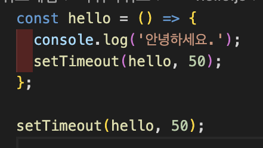
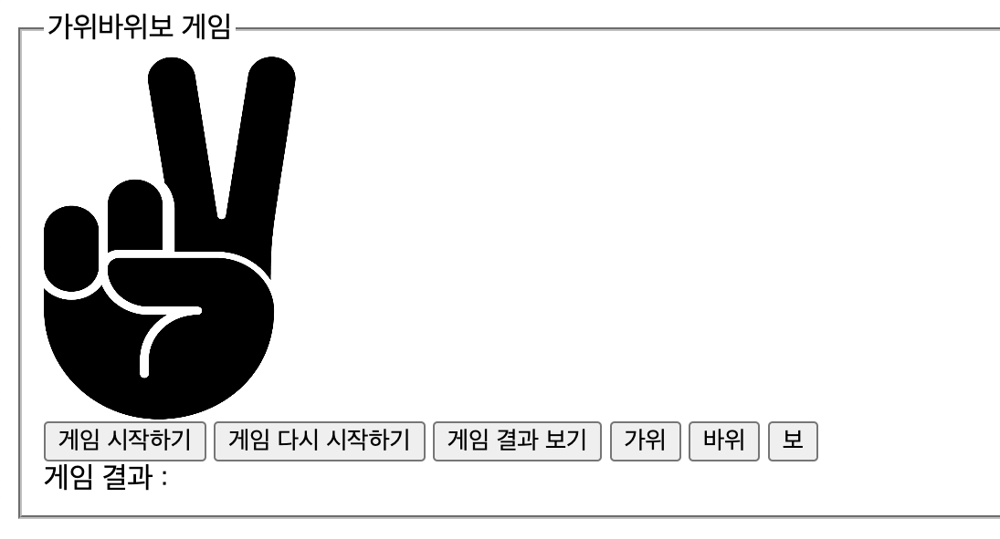
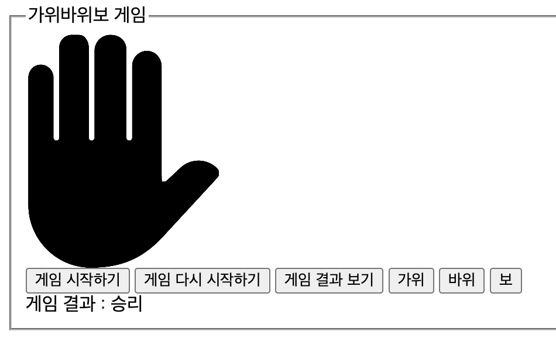
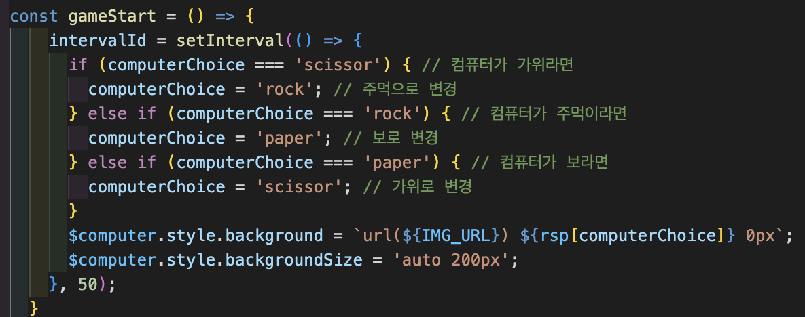
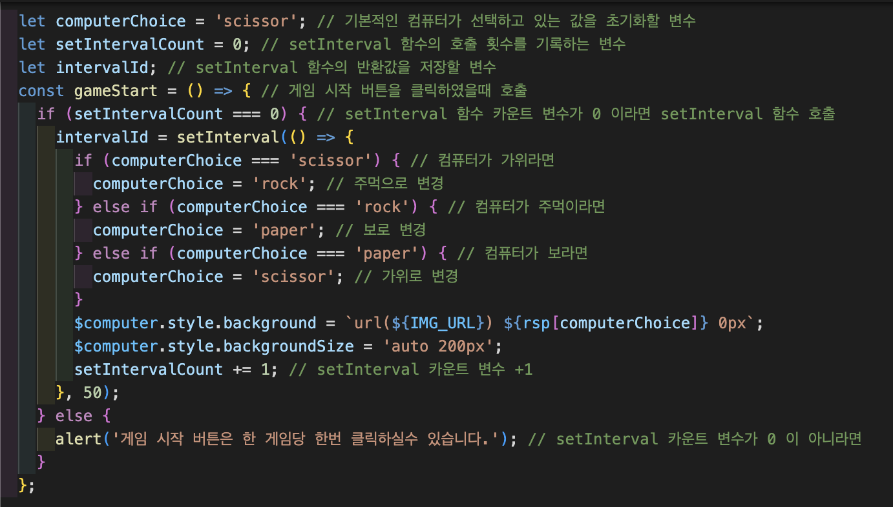
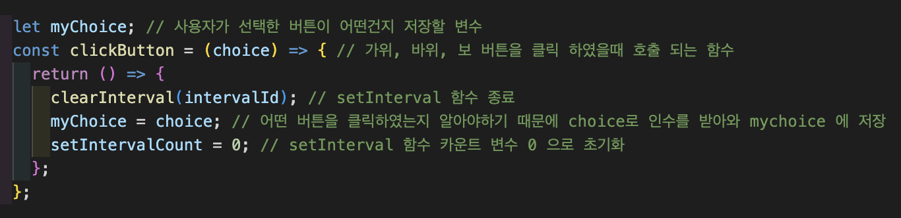
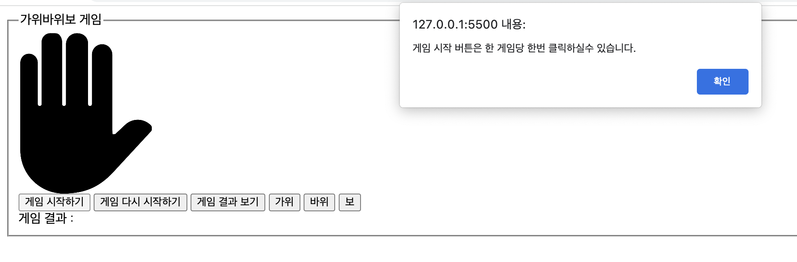
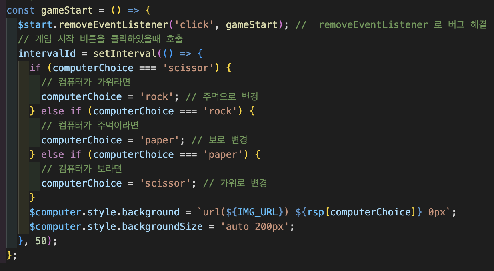
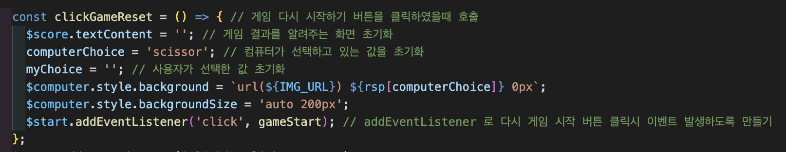

## 가위바위보 게임

### setInterval 함수 사용하기

가위바위보 게임에서 0.05초 간격으로 가위,바위,보 화면이 계속 바뀌어야 한다. 이때 사용하는 함수가 setInterval 함수이다.
setInterval(함수,몇 초 간격으로 함수를 호출할지) 함수의 사용 방법은 첫번째 인수에 호출할 함수를 넣고 두번째 인수에 몇초 간격으로 함수를 호출할지 넣어주면 된다.
1000 은 1000ms 로 1초기 때문에 가위바위보 게임에서는 0.05초마다 화면을 변경하는 함수를 호출해 화면을 변경한다.

위의 사진은 예시로 hello 라는 함수를 만들어 setInterval 함수를 이용해 0.05초마다 계속 호출하는 코드이다.

### setInterval 함수 setTimeout 함수로 대체하기

 setTimeout 함수로 setInterval 함수를 대체할 수 있다. setTimeout 함수로 함수를 호출하고 호출한 함수에서 setTimeout 함수를 호출하는 것이다. 하지만 setTimeout 함수는 정확하게 시간을  지켜서 호출되지 않기 때문에 최대한 원하는 시간에 함수를 계속 호출할려면 setInterval 함수를 호출하는것이 좋다.  

위의 사진은 예시로 hello 라는 함수를 만들어 setTimeout 함수를 이용해 setInterval 함수처럼 작동하도록 작성한 코드이다.

### clearInterval 함수, clearTimeout 함수 로 타이머 제거하기

사용자가 가위,바위,보 중에 어떤것을 낼지 선택하면 컴퓨터의 화면도 멈추면서 누가 이겼는지 비교해야 합니다. 그럼 setInterval 함수를 종료 시켜야 됩니다. 종료시키기 위해서 clearInterval 함수를 사용해야 합니다. setTimeout 함수는 반환값이 있는데 반환값을 clearInterval(반환값) 함수의 인수로 넘겨주면 함수를 종료시킬수 있습니다. 만약 setTimeout 함수를 사용했다면 clearTimeout 함수를 이용해 마찬가지로 인수로 넘겨주면 됩니다. 

### 가위바위보 게임 화면

 게임 설명 : 게임은 게임시작 버튼을 누르면 화면에서 가위,바위,보가 반복하여 바뀐다. 사용자가 무엇을 낼지 결정하고 가위, 바위, 보 중에 버튼을 클릭해서 선택한다. 그리고 게임 결과 보기 버튼을 누르면 승리, 무승부, 패배를 화면에 보여준다. 다시 게임을 시작하고 싶다면 게임 다시 시작 버튼을 클릭 후 게임시작 버튼을 다시 클릭하면 게임이 다시 시작된다.

게임을 만들면서 사용자가 무엇을 낼지 결정해 버튼을 클릭하면 화면이 멈추고 그러면서 변수에 저장된 값과 내가 클릭한 값을 비교해 결과를 화면에 보여주는 방식인데 가끔 컴퓨터선택 변수에 화면에 멈춘 그림과 다른 엉뚱한 값이 저장되어 게임 결과가 이상하게 나오는것이 확인 되었습니다. 아마 clearInterval 함수가 호출 되는 순간에 화면은 바뀌었는데 컴퓨터선택 변수에 값이 저장되지 못하고 종료된것이 아닌가 예상이 됩니다. 

게임 시작 화면 입니다.

저는 가위를 선택해 버튼을 클릭하였고 게임 결과를 확인한 화면 입니다.

### 가위바위보 게임의 버그 발견, 해결(if 문 사용)

게임이 작성한 코드대로 잘 작동하는지 확인해 보다가 게임 시작 버튼을 클릭하면 클릭할수록 화면에서 가위, 바위, 보 가 바뀌는 속도가 점점 더 빨라지는것을 확인했습니다. 그리고 이 상황에서 사용자가 가위, 바위, 보 버튼을 클릭해도 화면이 멈추지 않는 버그가 있었다. 

위의 사진에서 코드를 보면 게임 시작 버튼을 클릭하면 gameStart 함수가 호출되면서 내부에 setInterval 함수가 호출됩니다. 그리고 호출되면서 intervalId 변수에 값을 저장 합니다. 만약 연속해서 게임 시작 버튼을 클릭하게 되면 gameStart 함수가 연속해서 호출되고 내부의 setInterval 함수가 연속해서 호출되면서 화면이 바뀌는 속도가 빨라지는것처럼 보이고 함수의 반환값이 계속 앞에 호출된 반환값을 덮어쓰고 마지막에 호출된 반환값이 intervalId 에 저장되고 그 이전의 반환값들은 찾을수 없게 되어 사용자가 가위, 바위, 보 버튼을 클릭해 clearInterval 함수를 호출해도 게임 시작 버튼을 마지막으로 클릭하면서 호출한 setInterval 함수만 종료시킬수 있고 그 이전의 호출된 setInterval 함수들을 종료될수 없어 가위, 바위, 보 버튼을 클릭해도 화면이 멈추지 않는 것 입니다.
 

저는 이 에러를 해결하기 위해서 게임 시작 버튼을 클릭했을때 호출되는 gameStart 함수에서 setInterval 함수가 호출되기 전에 if 문으로 setInterval 호출 횟수를 확인하고 0 이라면 호출하고 호출 횟수를 +1 해주고 만약 0이 아니라면 에러메세지를 보여주도록 작성하였습니다. 그리고 사용자가 가위, 바위, 보 버튼을 클릭하였을때 clearInterval 함수를 호출하면서 setInterval 호출 횟수도 다시 0으로 초기화 해주면 위의 에러를 방지할 수 있게 됩니다. 

위의 사진과 같이 코드를 바꿔 에러를 해결 했습니다.

위의 사진은 게임 시작 버튼을 클릭한 상태에서 한번 더 클릭하면 에러 메세지가 보여지는 화면 입니다.

### 가위바위보 게임의 버그 해결2(removeEventListener)

버그를 해결할 수 있는 또다른 방법은 게임 시작 버튼을 눌렀을때 removeEventListener 를 사용해 다시 게임 시작 버튼을 눌러도 이벤트가 발생하지 않게 만들어 다시 setInterval 함수가 호출되지 못하게 만들고 게임 다시 시작하기 버튼을 클릭하면 addEventListener 로 게임 시작 버튼을 클릭 하였을때 다시 이벤트가 발생하도록 만드는 것 입니다.  

### 게임 시작 버튼을 클릭하였을때 호출되는 함수에 removeEventListener 추가

### 게임 다시 시작하기 버튼을 클릭하였을때 호출되는 함수에 addEventListener 추가

