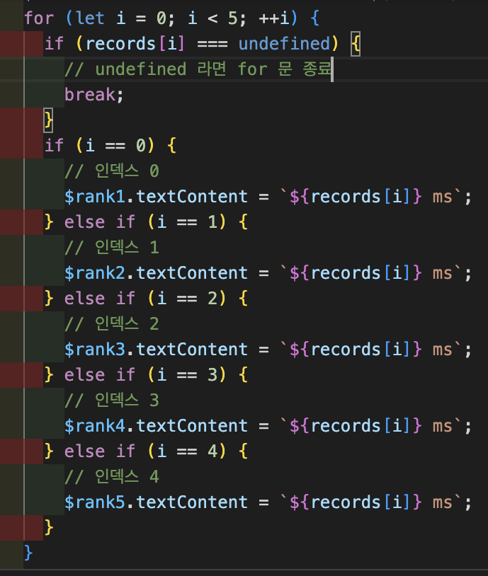

## 반응속도 테스트

### 화면을 클릭하였을때 어떻게 화면이 반응하도록 할 것인가?

화면 태그의 클래스 이름으로 화면을 변경한다. wait 는 대기화면, prepare 는 준비화면, start 는 시작 화면으로 구분합니다.

### 태그에 해당 클래스가 들어 있는지 확인하는 방법

태그.classList.contains("클래스") 문법을 사용하면 인수로 전달되는 클래스가 있다면 true, 없다면 flase 를 반환 합니다.

### 클래스 이름을 추가, 수정, 삭제하는 문법

1. 태그.classList.add("클래스") 문법을 사용하면 인수로 전달되는 클래스가 추가 됩니다.

2. 태그.classList.replace("변경하고 싶은 클래스", "변경 클래스") 문법을 사용하면 인수로 전달되는 클래스가 추가 됩니다.

3. 태그.classList.remove("삭제하고 싶은 클래스") 문법을 사용하면 인수로 전달되는 클래스가 추가 됩니다.

### 반응속도 결과가 NaN 이 나오는 문제

 let 이 블록 스코프를 가지기 때문에 new Date 를 사용해 각각의 시간을 기록할때 서로 다른 블록이라 그 값을 이용하려면 두 변수 모두 블록 밖에 선언해줘야 했다. 블록 밖에 startTime, endTime 변수를 선언하고 결과를 확인해볼려고 했는데... 결과는 NaN이 나오는것 이었다.

코드는 아래와 같이 작성하였다.

뭐가 문제인지 생각해보고 강의도 다시 들어보니 clickScreen 함수가 화면을 클릭할때마다 호출되기 때문에 startTime, endTime 변수가 호출될때마다 초기화가 되어 화면이 연두색일때 클릭하면 startTime 변수가 초기화되어 undefined 이므로 연산 결과가 NaN이 나오는 것 이었다. 이 문제를 해결할려면 변수 초기화를 아예 함수 밖으로 빼서 선언해야 한다.

위와 같이 코드를 함수 밖으로 빼서 선언하면

위와 같이 반응 속도 시간이 잘 나오는것을 확인할 수 있습니다.

## 준비 상태에서 화면을 클릭하였을때

화면이 빨간색일때 클릭하면 준비 상태인 파란색 화면으로 넘어 갑니다. 이때 코드에서는 setTimeOut 함수를 사용해서 2~3초 사이의 랜덤 시간이 흐르면 첫번째 인수로 전달되는 함수가 실행되도록 작성하였습니다.근데 만약 파란색 화면에서 클릭을 했다면 다시 대기 상태인 빨간색 화면으로 변경 됩니다. 여기서 setTimeout 함수는 아직 실행중이기 때문에 빨간색 화면에서 시작 상태인 연두색 화면으로 변경됩니다. 이 문제를 해결하기 위해서 저는 if 문을 사용해 클래스 이름이 대기 상태일때만 시작 상태로 변경되도록 코드를 작성하였습니다.

위 코드로 작성하였습니다. 또 다른 방법이 있습니다. setTimeout 함수의 반환 값을 받아 변수에 저장한 후 파란색 화면일때 클릭하면 clearTimeout 함수에 변수를 인수로 전달해 setTimeout 함수가 종료되도록 만드는 방법 입니다.

## 평균 반응속도 기능 추가

 반응속도를 측정할때마다 전에 기록을 기억하여 평균 반응속도를 화면에 보여주는 기능 입니다.

기능 구현 방법은 측정을 기록 할 records 배열을 전역 변수로 선언 합니다. 그리고 시작 상태에서 클릭 할때마다 반응속도를 records 배열에 저장하고 그 배열을 reduce 함수를 이용해 배열 값을 모두 더하고 배열의 길이로 나누어서 평균 속도를 화면에 보여주도록 하면 됩니다. 코드로 보면

위의 코드와 같이 작성하여 반응속도, 평균 반응속도를 구현하였습니다.

## reduce 메서드

위에 평균 반응속도를 구할 때 사용한 reduce 메서드에 대해서 알아보겠습니다. reduce(함수(누적 값,요소 값, 인덱스 , 배열) { 함수 실행문 return 반환값; }, 초기값) 문법으로 사용 됩니다. 만약 초기 값을 작성하지 않으면 배열의 첫번째 원소가 누적 값으로 함수가 실행 됩니다. 각각의 배열 값을 적용하여 함수를 실행한 후 마지막 누적 값을 반환 합니다.

## 반응속도 상위 5개 보여주는 기능 추가

기존의 반응속도를 기록하는 records 배열을 sort 메서드를 이용해 오름차순으로 정렬한 후 상위 5개 기록을 보여주는 기능을 구현했습니다. 상위 5개의 등수를 for 문을 돌려서 배열의 인덱스 0~4까지를 화면에 보여줘야 하는데 아직 배열에 요소 개수가 4개 이하라면 화면에 undefined 로 보여지는 등수가 있기 때문에 만약 인덱스 자리가 undefined 라면 굳이 for 문을 돌 필요가 없으니까 for 문을 break 로 탈출하도록 코드를 작성했습니다. 아래는 배열의 상위 5개 기록들을 화면에 보여주는 코드 입니다.

## 최종적으로 완성한 반응속도 테스트 입니다. (반응속도, 평균 반응속도, 반응속도 상위 5개 보여주는 기능)

