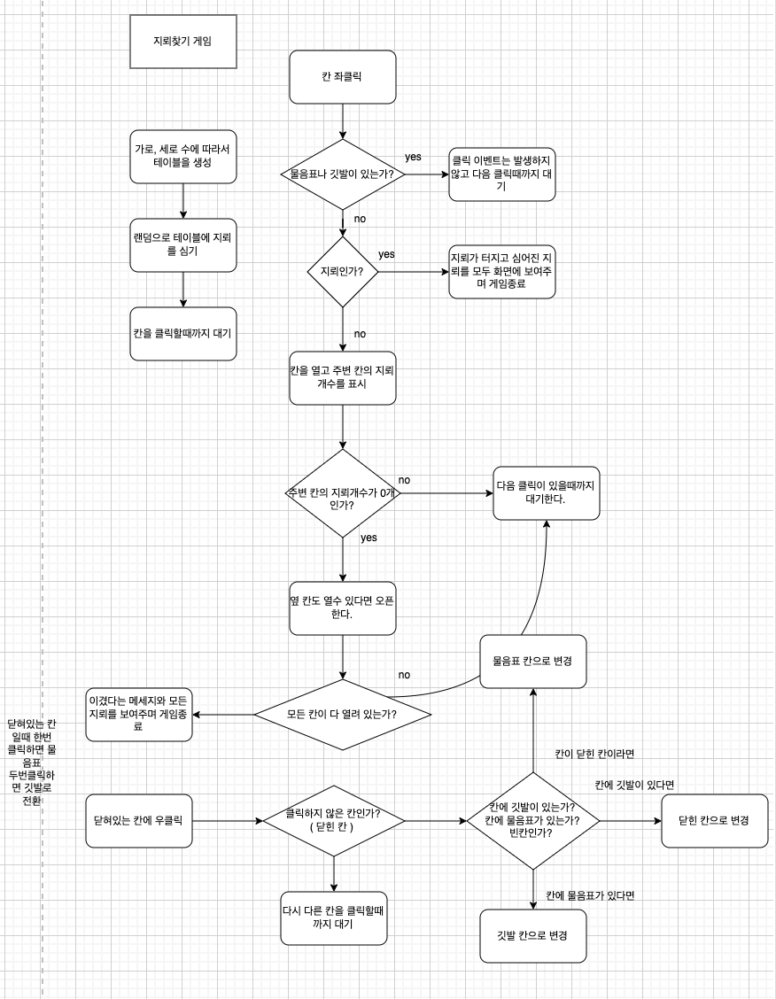
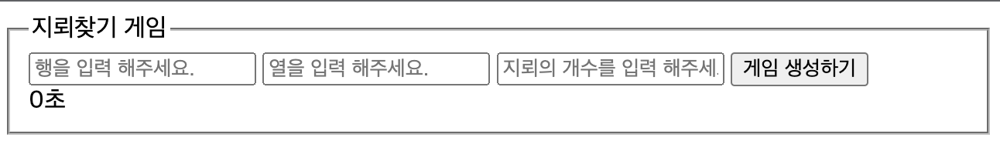
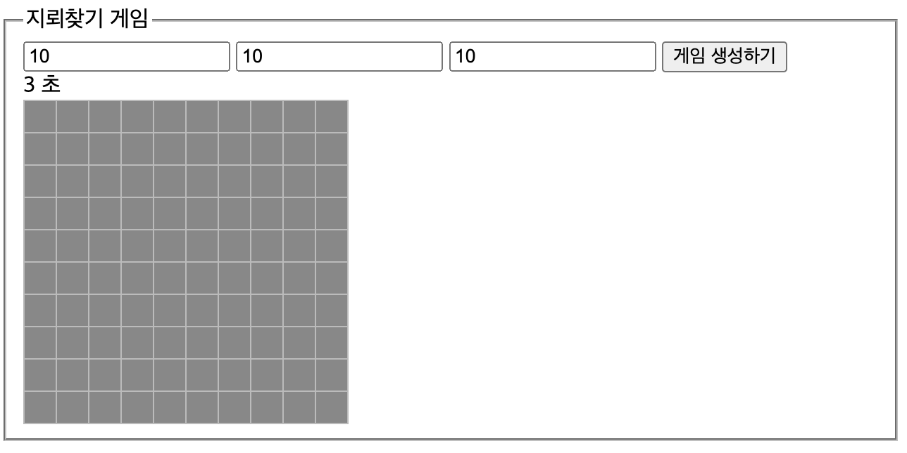
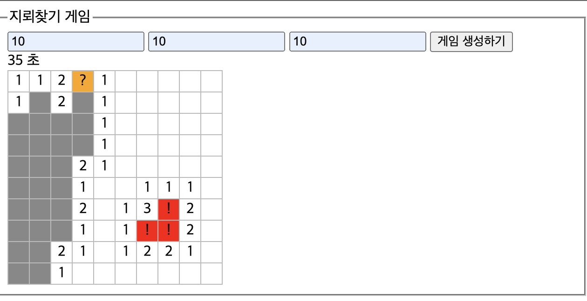
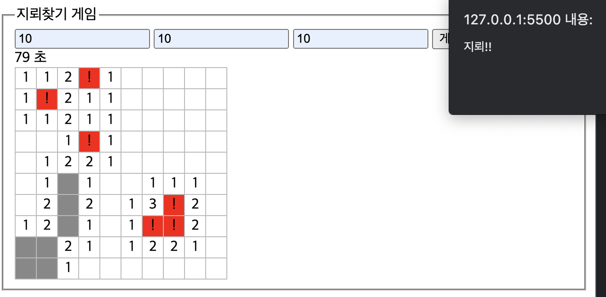
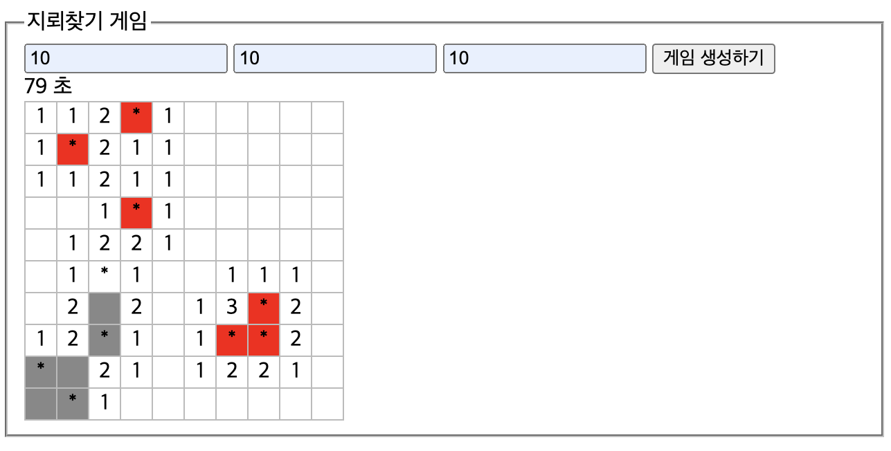
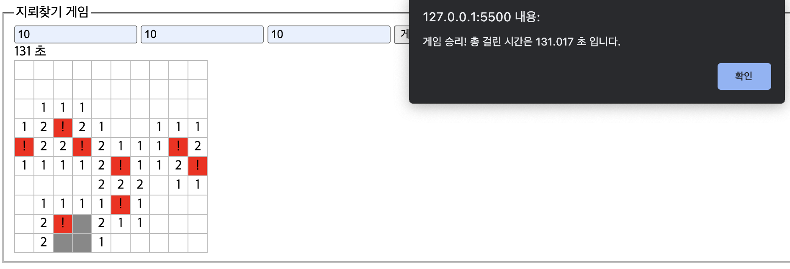

# 지뢰찾기 게임

우리가 알고 있는 지뢰찾기 게임을 만들어 봤습니다. 좌클릭은 닫혀있는 칸을 오픈하는데 사용하고 우클릭은 한번 클릭하면 물음표, 두번째 클릭하면 깃발, 다시 한번 클릭하면 닫혀있는 칸으로 돌아오는데 사용 합니다.
사용자가 원하는 칸수와 지뢰의 개수를 직접 지정해서 게임을 생성 할 수 있습니다. 게임 생성하기 버튼을 클릭하면 화면에 테이블이 생성되고 랜덤으로 칸에 지뢰가 심어지면서 게임이 시작되는데 그 순간부터 지뢰가 아닌칸을 모두 찾을때까지의 소요시간을 기록해서 알려주고 화면에 1초 간격으로 시간이 얼마나 지나고 있는지 보여 줍니다. 

# 게임을 만들면서 어려웠던 점

이전까지의 게임들은 이정도로 많은 칸의 데이터를 이벤트에 따라서 변경하고 또 그 변경 결과가 화면에도 반영되도록 화면도 변경해본 경험이 없었던 터라 데이터의 상태와 화면의 상태를 일치시키는 것이 쉽지 않았습니다. 그리고 지뢰가 없는 닫힌 칸을 클릭했을때 그 칸의 주변에 지뢰가 없어 0 이면 또 주변에 0 인 칸을 찾아 모두 열어주는 기능을 재귀함수로 구현해야 하는데 재귀함수로 기능을 구현한것이 처음이라 익숙하지 않아 쉽지 않았습니다. 

# 지뢰찾기 게임 순서도

# 지뢰찾기 게임 실행 화면

## 지뢰찾기 게임 처음 실행 화면

## 사용자가 원하는 행, 열, 지뢰 개수 입력하고 게임 생성하기 버튼 클릭 후 화면에 테이블 생성하면서 게임 시작

## 게임 진행중인 화면

## 지뢰를 클릭했을때 화면

## 게임이 종료되고 화면에 심어져있던 지뢰를 보여주는 화면

## 지뢰가 없는 닫힌 칸을 모두 오픈해 게임을 승리한 화면

# 지뢰찾기 게임을 만들면서 사용했던 함수들

지뢰찾기 게임을 만들면서 생성한 함수들을 간단하게 설명 합니다. 

1. plantMine() :  랜덤으로 지뢰를 심을 인덱스를 뽑아 칸의 정보가 담긴 data 배열을 생성하고 뽑은 랜덤 지뢰 인덱스를 data 배열 인덱스 자리에 지뢰로 정보를 변경 하는 함수 입니다.  
2. countMine(rowIndex, colIndex) : 인자로 넘겨 받은 행, 열 인덱스 자리의 주변 지뢰의 개수를 카운트 하는 함수 입니다.  
3. tagFindIndex(event) : 인자로 넘겨 받은 이벤트에 해당하는 td 태그와 일치하는 td 태그를 찾아 td 의 인덱스를 넘겨줘 td 의 위치를 찾는 함수 입니다.  
4. openAround(rI, cI) : 클릭한 칸의 행, 열 인덱스를 인자로 넘겨 받아 칸을 오픈하는 함수 open 을 호출해 인자로 넘겨 받은 위치의 칸의 주변 지뢰 개수가 0 개로 반환받으면 openAround 함수들을 주변 8 칸을 모두 호출해 재귀 함수를 만들어 주변 지뢰의 개수가 0 개인 칸을 모두 찾아 오픈 합니다.  
5. open(rowIndex, colIndex) : 인자로 넘겨 받은 행, 열 인덱스를 인자로 넘겨 받아 countMine 함수를 호출해 해당 칸의 주변 지뢰 개수를 반환받아 그 반환 값을 openAround 함수로 반환 해줍니다.  
이 함수에서는 재귀함수로 인해서 계속 호출될 수 있기 때문에 너무 많은 연산이 발생 할 수 있습니다. 칸을 오픈하면서 칸의 데이터 정보도 변경 했기 때문에 이미 오픈한 칸은 다시 오픈하지 않고 함수를 종료하도록 하고 행,열 인덱스의 위치가 범위를 벗어난다면 함수를 종료되도록 합니다. 그리고 칸을 오픈하면서 총 칸에서 지뢰의 개수 빼고 모두 칸을 열었으면 게임을 종료 합니다.  
6. clickLeftBlock(event) : 블럭을 좌클릭하면 호출되는 콜백 함수 입니다. 칸이 지뢰가 없고 닫힌 칸이라면 칸을 오픈합니다. 칸이 지뢰가 있고 칸이 닫혀 있다면 오픈하고 게임이 종료 됩니다. 게임이 종료되고 지뢰가 어디에 심어져 있었는지 화면에 보여 줍니다. 또 클릭한 칸이 물음표나 깃발이라면 함수를 종료 합니다.  
7. clickRightBlock(event) : 블럭을 우클릭하면 호출되는 콜백 함수 입니다. 칸을 클릭하면 칸을 물음표, 깃발로 변경하게 됩니다. 이때 칸에 지뢰가 있는지 없는지 또 물음표, 깃발로 변경하면서 화면도 변경되기 때문에 데이터에 클릭한 칸이 지뢰가 있었는지 없었는지 모두 데이터에 반영해야 하고 다시 우클릭해서 닫힌 칸으로 돌아올때 데이터도 그대로 돌아와야 합니다. if 문을 통해 상황에 따리서 화면과 데이터를 일치시키도록 합니다.  
8. drawTable() : 화면에 테이블을 그리고 plantMine 함수를 호출해 지뢰를 심고 모든 td 태그에 좌클릭, 우클릭 이벤트를 추가하는 함수 입니다.  
9. onSubmit(event) : 사용자가 원하는 칸과 지뢰의 개수를 입력하고 게임 생성하기 버튼을 클릭하면 이벤트가 발생해 호출되는 콜백 함수 입니다. 입력되서 들어오는 행, 열, 지뢰의 개수를 받아 변수에 저장하고
오픈한 칸을 카운트 하는 변수와 tbody 자식 태그를 모두 초기화 하고 drawTable 함수를 호출해 화면에 테이블을 다시  그립니다. 그리고 화면에 테이블을 그리는 순간 부터 시간을 보여주는 기능을 setInterval 함수를 이용해 구현 합니다.  

# 추가 기능1 - 첫번째 클릭할때 무조건 첫 클릭의 칸은 지뢰가 없도록 하는 기능

 화면에 테이블이 그려지고 첫번째 클릭할때 항상 첫번째 클릭은 지뢰가 없는 닫힌 칸이 되도록 합니다.  

방법 1. 화면을 먼저 모두 지뢰가 없는 칸으로 생성하고 첫 클릭 후에 클릭한 td 의 인덱스 값을 빼고 나머지 인덱스로 랜덤으로 지뢰를 심을 인덱스를 꺼내 첫 클릭 후 지뢰를 심는 방법이 있습니다.  
방법 2. 원래 하던대로 사용자가 행, 열, 지뢰 개수를 입력하고 게임 생성하기 버튼을 클릭하면 화면에 테이블이 그려지며 자동으로 지뢰가 심어지는데 만약 첫 클릭한 칸에 지뢰가 심어져 있다면 지뢰를 옆칸으로 이동해 다시 심는 방법 입니다. 옆에 칸에도 지뢰가 심어져 있을수도 있기 때문에 재귀함수를 사용해 지뢰가 없는 칸을 찾으면 재귀함수를 종료하는 방법이 있습니다.  

두 방법 모두 구현 하였습니다.

# 추가 기능2 - 게임종료가 되면 지뢰를 모두 화면에 보여주는 기능

지뢰가 없는 칸을 모두 오픈했거나 지뢰가 있는 칸을 클릭해서 게임이 종료되면 지뢰가 어디에 심어져 있었는지 화면에 보여주는 기능을 구현 하였습니다.

# 게임을 만들면서 배운 것들

## 클릭한 태그의 위치 인덱스 위치 알아내기

 저는 클릭한 태그의 위치를 알아내기 위해서 tagFindIndex(event) 함수를 생성 하였습니다. 제로초님의 강의에서는  
tagFinfIndex 함수의 기능을 제로초님은  
const rowIndex = event.target.paretNode.rowIndex;  
const cellIndex = event.target.cellIndex;  
코드로 구현 하셨습니다. 이런 프로퍼티를 몰라 직접 함수를 생성하였는데 좀 더 공부를 열심히해서 쉽게 기능을 구현해야될것 같다는 생각이 들었습니다.

## 논리 연산자의 진짜 뜻

|| 앞에 평가 값이 true 면 true 로 평가된 값 반환 후 종료 false 면 뒤에꺼 평가  
&& 앞에 평가 값이 true 면 뒤에꺼 판단 false 면 false 로 평가된 값 반환 종료

## contextmenu 이벤트

마우스 좌클릭 이벤튼 click 입니다. 마우스 우클릭 이벤트는 contextmenu 입니다. contextmenu 이벤트는 기본적으로 브라우저 메뉴를 띄우므로 기본 동작을 막기 위해서 event.preventDefault 메서드를 호출 해줘야 합니다. 

## 옵셔널 체이닝

 ?. 는 옵셔널 체이닝이라는 문법 입니다. 예를 들어 a?.b 으로 옵셔널 체이닝 문법을 사용하면 a 가 참이라면 뒤 코드를 사용하고 거짓 이라면 뒤에 b 는 보지도 않고 undefined 가 됩니다.
객체, 배열, 함수 모두 사용 가능 합니다. 

## 널 병합 연산자

 ?? 앞에 평가 값이 null, undefined 이면 뒤에 평가 값 평가 후 평가 값 반환 아니라면 앞에 평가 값 반환 

## 재귀 함수

 어떤 함수의 내부에서 자기 자신을 다시 호출하는 함수를 재귀 함수라고 합니다. 재귀 함수를 사용할 떄 호출 스택의 크기를 초과해 웹사이트가 멈추는 상황이 발생하는데 이떄 Maximum call stack exceeded 오류가 발생하게되어 그런 것 입니다. setTimeout 과 같은 비동기 함수를 사용하면 이 에러를 쉽게 해결 할 수 있습니다. 
 

