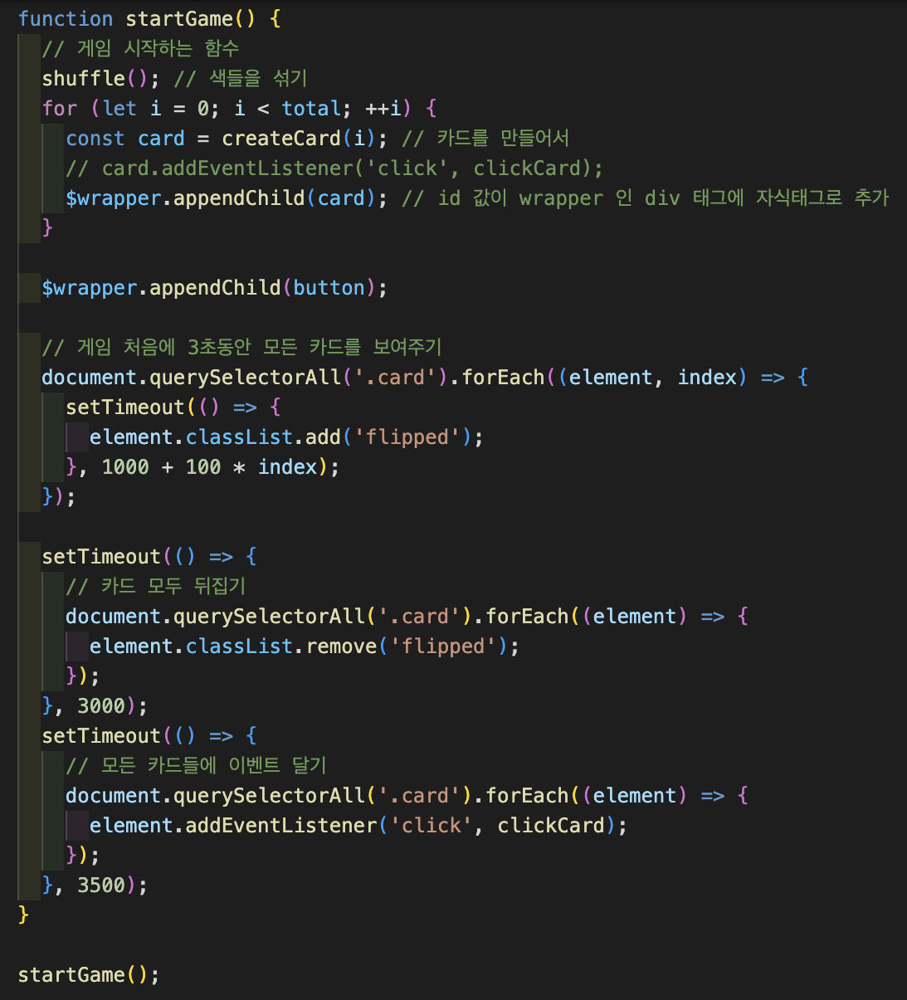

# 카드 짝맞추기 게임

같은 색깔의 카드를 총 2개씩 총 6종류 12개의 카드로 게임을 시작 합니다. 카드를 랜덤으로 섞고 게임이 시작되면 먼저 모두 뒤집어 카드를 보여줍니다. 그 후 3초가 지나면 모든 카드를 뒤집어 카드를 클릭해 같은 색의 카드를 찾아 짝을 맞추는 게임 입니다.

# 카드 짝맞추기 게임 실행 화면

## 처음 카드가 모두 뒤집혀 있는 화면

## 카드를 뒤집어 일정시간 동안 보여주는 화면

## 카드의 짝을 모두 맞추면 축하합니다를 보여주는 화면

## 추가 기능, 카드의 개수를 입력 받는 화면

## 추가 기능, 홀수를 입력하면 알림 메세지 뜨는 화면

## 추가 기능, 20 개를 입력하여 모든 카드의 짝을 맞추고 소요시간을 알려주는 화면

# 게임을 만드는데 사용한 주요 코드들을 설명

게임을 만드는데 사용한 주요 코드들을 설명 하겠습니다.

# 카드를 생성할때 필요한 변수 생성

카드의 총 개수 total 변수, 카드의 색 종류를 모아둔 배열 colors , 같은 색깔이 두개씩 필요하기 때문에 colorCopy 변수에 color 배열 concat 메서드로 복사, colorCopy 배열들을 섞어서 저장할 randomColors 배열을 생성 합니다. 

# 카드의 색을 무작위로 섞기

 카드를 무작위로 섞기 위한 shuffle 함수 입니다. colorCopy 배열의 길이 안의 숫자에서 랜덤 숫자를 꺼내  splice 로 colorCopy 배열에서 랜덤 숫자에 해당하는 색을 꺼내 randomColors 배열에 추가 합니다. 이렇게 colorCopy 배열에 아무 요소가 없을때까지 반복 합니다.   

# 카드를 생성하는 함수

 카드를 생성하는 함수 입니다. 하나의 카드에 구성되는 태그들을 생성하고 randomColors 배열에 있는 요소를 한개씩 꺼내서 카드를 구성하는 태그에 backgroundColor 로 지정합니다.

# 게임을 시작하는 함수

 startGame 함수로 12개의 카드를 생성 합니다. 그 후 카드를 한개씩 setTimeout 메서드를 사용해 화면에 보여주고 다시 일정시간이 지난 후에 setTimeout 메서드로 모든 카드를 뒤집어 줍니다. 그리고 모든 카드에 forEach 메서드를 사용해 addEventListener 을 걸어줍니다.

# 선택한 카드를 저장 할 배열, 선택한 카드가 같은 색깔이면 저장할 배열

 선택한 카드를 저장해야하기 때문에 선택한 카드를 저장 할 배열을 생성하고 선택한 카드가 같은 색깔이면 짝을 맞춘 카드를 구분하기 위해서 같은 색깔인 카드를 저장할 배열을 생성 합니다.

# 카드를 클릭하면 발생하는 이벤트로 호출되는 콜백함수

카드를 생성하면서 모든 카드에 이벤트 리스너를 달아줬습니다. 이제 카드를 클릭하면 이벤트가 발생하여 clickCard 콜백함수가 호출 됩니다. 콜백함수에서는 클릭한 카드는 if 문을 통해 choiceCard 배열의 길이가 2보다 작다면 클릭한 카드의 이벤트를 제거하고 choiceCard 배열에 카드를 추가 합니다. 그리고 클릭한 카드의 태그에 클래스 리스트에 flipped 를 추가 합니다. 클릭한 카드의 이벤트를 제거하는 이유는 아래에서 설명하겠지만 연속클릭,짝이 맞춰진 카드 클릭 등의 버그 문제를 해결하기 위해 클릭한 카드는 이벤트를 제거 합니다. 그리고 두번째 카드를 클릭하면 choiceCard 배열의 길이가 2가 되기 때문에 이제 선택 한 두개의 카드가 같은지 체크하는 checkSameCard 함수를 호출하도록 합니다. 하지만 바로 호출하게 되면 두번째 클릭하는 카드가 뒤집히기도 전에 두카드의 같은지 여부의 결과가 나오게 되어 두번째 카드는 뒤집히지 않게 됩니다. 그래서 setTime 메서드를 사용하여 시간을 조금 두고 카드의 색을 판단하는 함수를 호출하는 방법을 사용 합니다. 그리고 연속해서 카드를 클릭하게되어 3개 이상의 카드가 선택되면 안되기 때문에 선택한 카드가 2개가 되어 choiceCard 배열의 길이가 2가 되면 카드를 클릭해도 콜백함수가 호출되고 바로 종료되도록 코드를 작성 하였습니다. 

# 선택한 두개의 카드의 색이 같은지 판단하는 함수

 선택한 카드의 색이 같은지 판단하는 함수 입니다. 만약 같다면 choiceCard 에 저장되어 있는 카드들은 completeCard 배열에 추가하고 다시 다른 카드를 클릭해서 짝을 맞춰야 하기 때문에 choiceCard 배열은 비워둡니다. 그리고 completeCard 의 길이가 12가 되면 모든 카드의 짝을 맞춘 것이기 때문에 카드를 모두 맞췄다는 메세지를 보여 줍니다. 클릭한 카드의 색이 다르다면 두 카드의 클래스 리스트의 flipped 를 제거하고 두 카드의 이벤트도 다시 달아서 클릭하면 이벤트가 발생 할 수 있도록 합니다. 

# 게임 다시 시작하기 버튼을 클릭하면 게임이 다시 시작되는 콜백 함수

 모든 카드의 짝을 맞춰 completeCard 배열의 길이가 12가 되어 카드를 모두 맞췄다는 메세지가 화면에 보여 집니다. 이후부터는 게임 다시 시작하기 버튼을 클릭하기 전까지는 화면에 어디를 클릭해도 이벤트가 발생하지 않습니다. 그 이유는 카드를 클릭할때 이벤트를 제거 해주는데 모든 카드의 짝이 맞다면 모든 카드의 이벤트가 제거 되어 있기 때문 입니다. 여기서도 클릭하는 카드의 이벤트를 제거하는 이유가 있는데 만약 이벤트를 제거하지 않았다면 모든 카드가 짝이 맞아서 게임이 종료 되어도 카드를 클릭하면 카드가 뒤집히기 때문에 게임이 종료되면 게임을 다시 시작하기 전까지 카드를 클릭할 수 없도록 하는 목적으로도 사용 됩니다.게임 다시 시작하기 버튼을 클릭한다면 모든 카드를 뒤집고  id 이름이 wrapper 태그의 자식 태그를 모두 삭제 합니다. 그리고 다시 colorCopy 배열을 생성하고 randomColors , completeCard 배열을 모두 초기화 합니다. 그래야 새로운 랜덤 카드를 생성하고 짝을 맞춘 카드를 저장할 수 있겠습니다. 그리고 startGame 함수를 호출해 게임을 다시 시작합니다. 코드를 보면 모든 카드를 뒤집고 이후부터 코드들은 setTimeout 메서드의 콜백함수로 들어가 있습니다. 그 이유는 이렇게 안하면 카드가 모두 뒤집히기 전에 새로운 카드를 생성하고 게임이 시작되기 때문입니다.

# 추가 기능 1 => 20까지의 숫자를 입력 받아 그 숫자만큼 카드를 생성하고 짝맞추기 게임을 진행 (짝수만 입력 가능)

 원하는 카드의 개수를 입력해 짝맞추기 게임을 진행하는 기능 입니다. 카드의 최대 개수는 20개이고 짝수의 카드 개수만 입력 가능 합니다. 짝수를 입력하지 않았다면 다시 입력 하도록 코드를 while 문을 통해 작성합니다. 짝수라면 while 문을 탈출 합니다. 그리고 colors 의 색을 10개로 만들고 입력되는 카드 개수의 변수인 total 을 2로 나눈 값을 개수를 colors 배열에서 slice 메서드로 꺼내와 배열을 생성해 colorCopy 배열을 생성합니다. 이 배열을 가지고 randomColors 배열을 생성해 카드를 만듭니다. 

# 추가 기능 2 => 모든 카드의 짝을 맞추는데 소요되는 시간 측정

 모든 카드의 짝을 맞추는데 소요되는 시간을 측정하는 기능 입니다. 

위의 코드처럼 startTime 변수는 전역 변수로 선언하고 startGame 함수의 마지막 setTimeout 메서드의 콜백함수 마지막에 new Date 를 사용해서 startTime 변수에 시간을 저장하고 모든 카드의 짝을 맞추고 endTime 의 변수를 선언하면서 new Date 로 시간을 저장해서 (endTime - startTime) / 1000 으로 소요된 시간을 화면에 보여 줍니다. 1000 으로 나눈 이유는 결과의 단위가 ms 이기 때문에 초를 화면에 보여주기 위해서 1000 을 나눠 준 것 입니다.

# 이벤트 루프와 호출스택

백그라운드 : 타이머를 처리하고 이벤트 리스터를 저장하는 공간입니다. 비동기 함수를 등록한다. 예를 들어 setTimeout 함수는 실행되면 백그라운드에서 시간을 재고 시간이 지나면 콜백 함수를 태스크 큐로 보내게 됩니다. 이벤트 리스너는 추가한 이벤트를 저장했다가 이벤트가 발생하면 콜백 함수를 태스크 큐로 보냅니다. 백그라운드에서는 코드가 실행되지 않고 실행될 콜백 함수들을 태스크 큐로 보냅니다.

 태스크 큐 : 실행되어야 할 콜백 함수들이 줄을 서서 대기하고 있는 공간을 말합니다. 큐의 자료구조처럼 먼저 들어온 함수부터 실행 됩니다. 태스크 큐에서는 함수를 직접 실행하지 않고 호출 스택에서 함수가 호출되어 실행 됩니다. 호출 스택으로 함수를 이동시키는 역할을 하는것이 이벤트 루프 입니다. 호출 스택이 비어있게 되면 이벤트 루프는 태스크 큐에 줄 서 있는 함수들을 순서대로 꺼내 스택으로 옮겨 함수가 실행 되는 것 입니다. 실행이 완료된 함수는 호출 스택에서 빠져 나가고 호출 스택이 비면 다시 이벤트 루프가 태스크 큐에서 함수를 가지고 오는 것 입니다.

대부분의 비동기 코드들이 백그라운드에 저장된다. 어떤 자바스크립트든 처음에 anoaymous 가 실행된다.

# 발견한 버그

1. 짝이 맞게 12개의 카드를 모두 찾아 뒤집었는데 카드 클릭이 되어 카드가 뒤집힐때, 게임 다시 시작하기 버튼을 클릭하기 전까지 모든 카드를 클릭해도 이벤트가 발생하지 않도록 해야함.  
해결 방법 : 마지막 12번째 카드를 클릭해 짝이 모두 맞다면 forEach 를 이용해서 card 클래스의 태그 들은 모두 removeEventListenr 로 클릭해도 이벤트 발생이 일어나지 않도록 해야 한다. 그리고 다시 시작하기 버튼을 클릭하면 startGame 함수가 호출되기 때문에 다시 모든 card 클래스를 가지는 태그에 addEventListener 를 달아주기 때문에 클릭하면 이벤트가 발생할 것이다.

2. 한번 클릭한 카드는 뒤집은 카드가 2개가 되어 같은 색깔의 카드인지 판단되기 전까지 클릭하면 이벤트가 발생하지 않도록 해야함.  
   해결 방법:  각각 카드를 클릭해서 clickCard 함수가 호출되면 클릭한 태그를 removeEventListenr 로 두개의 카드가 모두 클릭되어 색깔 판단이 완료될때까지 클릭을 못하게 하고 판단이 끝나고 같은 색깔이면 그대로 두고 다른 색깔이면 다시 addEventListener 로 클릭하면 이벤트가 발생하도록 한다.

 이렇게 보니까 결국 모든 카드를 뒤집게 되면 모든 카드가 removeEventListener 가 적용되기 때문에 1번은 진행할 필요가 없다. 

3. 빠르게 2개 이상의 카드를 클릭해도 선택은 2개까지만 되어야함
   해결 방법 : 카드를 선택할때 그 카드를 저장하는 배열인 choiceCard 리스트의 길이가 2가 되면 바로 클릭해 이벤트를 발생시켜도 카드 색깔을 판단하고 choiceCard 배열을 모두 초기화하기 전까지는 return 으로 함수가 호출되어도 종료되도록 만든다. 

4. 하나의 카드를 연속 클릭이 불가능하게 해야함. 연속 클릭하면 choiceCard 배열에 저장되고 배열의 길이가 2가 되면 카드의 색깔을 판단하는 함수가 호출된다. 결과적으로 같은 색깔의 카드를 선택한 결과와 같게 프로그램이 실행된다.
   해결 방법 : 이것도 2번과 같은 해결책으로 카드를 클릭하고 두개의 카드가 선택되어 같은 색깔인지 판단하는 결과가 나올때까지 각각의 클릭 카드를 removeEventListener 로  클릭해도 이벤트가 발생하지 않도록 해야 한다. 제로초님은 choiceCard 배열 0번쨰 자리와 2번쨰 클릭한 카드의 this 가 같다면 클릭하지 못하도록 만드셨다. 

5. 이미 짝이 맞는 카드를 클릭하면 이벤트가 발생하여 카드가 뒤집힘
   해결 방법 :ㅣ이것도 2번과 같은 해결책 이벤트를 발생하지 않도록 해두면 다시 클릭이 불가능 해진다. 제로초님은 completeCard 배열에 includes 메서드를 사용해 클릭한 카드가 배열에 있다면 클릭 못하도록 만드셨다. 

6. 카드를 모두 보여주고 다시 모두 뒤집을때 클릭하면 이벤트가 발생하지 않도록 해야함
   해결 방법 : 기존의 코드는 card 를 생성하면서 하나씩 addEventListener 을 달아줬는데 카드를 모두 보여주고 다시 뒤집는 코드 다음에 setTimeout 안에 실행함수로 forEach 를 넣어서 이벤트를 달아주면서 해결하면 된다. 이 코드의 문제는 위에 모든 카드를 보여주고 뒤집어 주는 코드의 setTimeout 메서드의 타이머를 계산해서 이벤트를 달아주는 코드의 setTimeout 메서드의 타이머를 지정해줘야 하는데 시간이 정확하지 않아 좋은 방법이라고 생각하지 않습니다.
   제로초님은 불리안 값을 가지는 변수를 만들어 초기값으로 false 를 주고 변수 값이 false 일때는 클릭 못하게 하고 만들어 카드를 모두 보여주고 뒤집는 코드에 변수 값을 true 로 바꿔주는 코드로 해결 하심 

7. 제로초님이 찾으신 버그 중 다른 4개의 카드를 연달아 클릭했을떄 마지막 두개가 뒤집혀 있는 문제를 찾으셨는데 저는 애초에 카드를 선택하면 choiceCard 배열에 저장되고 배열의 길이가 2 보다 크면 클릭해도 clickCard 함수가 호출되어도 choiceCard 배열의 길이가 2라서종료되도록 만들었기 때문에 이 버그는 발생하지 않았습니다. 제로초님이 작성하신 코드에서 에러가 나는 이유는 카드를 클릭하면 바로 choiceCard 배열에 집어 넣고 길이가 2일때만 두 카드의 색깔을 비교하는 코드가 실행되는데 연속으로 4개의 카드를 클릭하게 되면 백그라운드에 저장되어 있던 이벤트 리스너로 인해 이벤트가 발생하여 콜백 함수가 태스크 큐로 전달 됩니다. 4개의 카드를 클릭하였기 때문에 4개의 콜백함수가 태스크 큐로 전달되고 하나씩 호출 스택으로 전달되어 콜백함수가 호출되는데 1번째 카드의 콜백 함수는 배열에 저장되고 배열에 길이가 2가 아니기 때문에 종료된다. 2번째 콜백 함수가 호출되었을때 배열에 저장되고 배열의 길이가 2라서 카드의 색깔을 비교하는 코드가 실행되고 카드의 색깔이 다르기 때문에 카드를 다시 뒤집기 위해서 setTimeout 가 실행되며 타이머가 지난 후 콜백 함수가 태스크 큐에 전달된다. 이때 태스크 큐에 먼저 들어온 함수는 3,4번째 카드를 클릭하면서 발생한 이벤트의 콜백함수이기 때문에 먼저 실행된다. 여기서 제로초님의 코드는 조건 없이 바로 choiceCard 배열에 저장되는 코드이기 때문에 3,4 번째 콜백 함수는 모두 배열에 저장된다. 두 함수 모두 배열의 길이는 2가 아니기 때문에 그 이후 코드는 실행되지 않는다. 그 후 2번째 콜백함수가 실행되면서 호출된 setTimeout 함수의 콜백함수가 실행되면서 1,2 번째 카드는 다시 뒤집어지고 choiceCard 배열은 초기화 된다. 이렇게 되면 3,4 번째 클릭한 카드는 다시 뒤집어지지 못하게 되고 화면에 남게 된다. 이런 에러를 잘 파악하기 위해서는 이벤트 루프와 호출스택에 대해서 잘 알아야 한다. 제로초님은 2번째 카드를 클릭했을때 배열의 길이가 2가 되어 카드의 색깔을 판단하는 코드가 실행되는데 이때 변수의 불리언 값으로 카드가 클릭해도 이벤트 콜백함수가 종료되도록 하는 용도로 사용되는 clickable 변수를 false 로 만들고 3,4번쨰 클릭 으로 발생하는 콜백함수가 실행될때는 클릭 이벤트 콜백 함수가 종료되고 setTimeout 콜백 함수에서 실행되고 그 변수를 true 로 바꿔 다시 카드를 클릭 할 수 있도록 만드셨습니다. 

# 이벤트 루프와 호출스택

백그라운드 : 타이머를 처리하고 이벤트 리스터를 저장하는 공간입니다. 예를 들어 setTimeout 함수는 실행되면 백그라운드에서 시간을 재고 시간이 지나면 콜백 함수를 태스크 큐로 보내게 됩니다. 이벤트 리스너는 추가한 이벤트를 저장했다가 이벤트가 발생하면 콜백 함수를 태스크 큐로 보냅니다. 백그라운드에서는 코드가 실행되지 않고 실행될 콜백 함수들을 태스크 큐로 보냅니다.

 태스크 큐 : 실행되어야 할 콜백 함수들이 줄을 서서 대기하고 있는 공간을 말합니다. 큐의 자료구조처럼 먼저 들어온 함수부터 실행 됩니다. 태스크 큐에서는 함수를 직접 실행하지 않고 호출 스택에서 함수가 호출되어 실행 됩니다. 호출 스택으로 함수를 이동시키는 역할을 하는것이 이벤트 루프 입니다. 호출 스택이 비어있게 되면 이벤트 루프는 태스크 큐에 줄 서 있는 함수들을 순서대로 꺼내 스택으로 옮겨 함수가 실행 되는 것 입니다. 실행이 완료된 함수는 호출 스택에서 빠져 나가고 호출 스택이 비면 다시 이벤트 루프가 태스크 큐에서 함수를 가지고 오는 것 입니다.

대부분의 비동기 코드들이 백그라운드에 저장된다.
