# 텍스트 RPG 게임

텍스트로 RPG 게임을 만들었습니다. 캐릭터 생성, 모험, 휴식, 종료, 회복, 도망 의 기능을 구현 했습니다. text-RPG.js 파일에서는 각각의 함수를 만들어 원하는 버튼을 클릭하면 이벤트가 발생하여 함수가 호출되어 실행되는 코드로 작성했고 text-RPG-Class.js 파일에서는 하나는 Game(게임 안에서 구성되는 객체들과 메서드들을 생성), Hero(hero 의 객체를 생성), Monster(monster 의 객체를 생성), commonProperties(Hero, Monster 클래스에 공통되는 코드를 하나의 클래스로 만들어 두 클래스에 상속) 클래스 들을 정의해 서로 상호 작용 하도록 코드를 작성하고 Game 클래스로 생성한 객체 안에서 hero, monster 객체와 메서드들이 서로 상호 작용하여 게임이 진행되도록 코드를 작성하였습니다.

# 텍스 RPG 게임 순서도

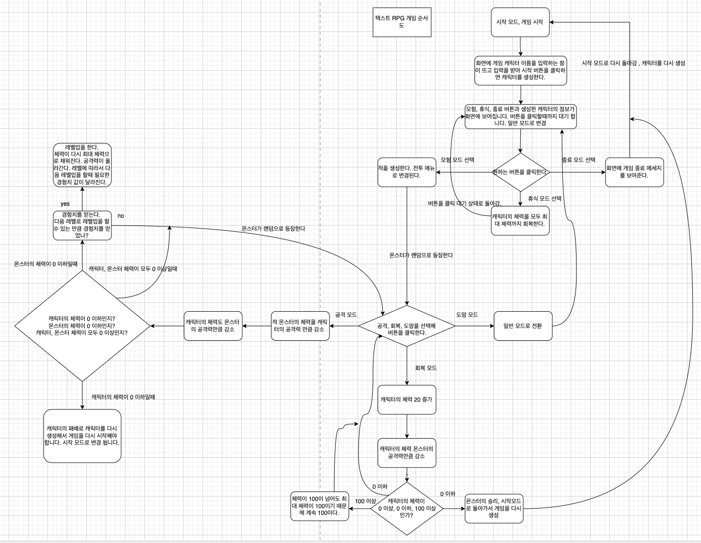

# 캐릭터 생성

캐릭터를 생성하는 단계 입니다. 사용자가 원하는 캐릭터의 이름을 키보드로 작성해 시작을 클릭하면 캐릭터가 생성 됩니다. 사용자가 입력한 캐릭터의 이름은 hero 객체를 생성하는데 사용 됩니다.

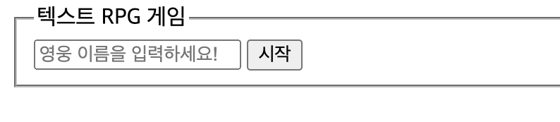

위의 사진은 게임시작 화면 입니다.

# 캐릭터 이름 입력 후 일반 모드 화면

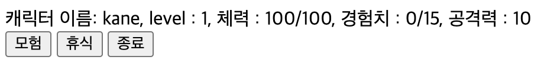

위의 사진은 게임 캐릭터 이름을 입력하고 시작 버튼을 클릭하면 일반모드로 변경된 화면 입니다.

모험 버튼을 클릭하면 전투 모드로 화면이 변경되어 몬스터와 전투를 진행하게 됩니다.  
휴식 버튼을 클릭하면 캐릭터의 체력을 100 으로 채워 줍니다. 캐릭터의 최대 체력은 100 입니다.  
종료 버튼을 클릭하면 game, hero, monster 의 모든 객체의 정보를 null 로 날리면서 모두 초기화되고 시작 화면으로 돌아 갑니다. 캐릭터를 다시 생성해야 합니다.

# 모험 버튼을 클릭 했을 때 전투 모드 화면

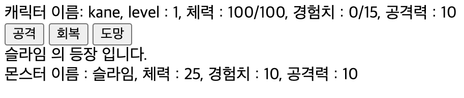

위의 사진은 모험 버튼을 클릭 했을떄 전투모드의 화면 입니다. 
공격, 회복, 도망 버튼을 클릭 할 수 있고 랜덤으로 몬스터가 등장 합니다.

# 전투 모드에서 공격 버튼을 클릭 하였을 때 화면

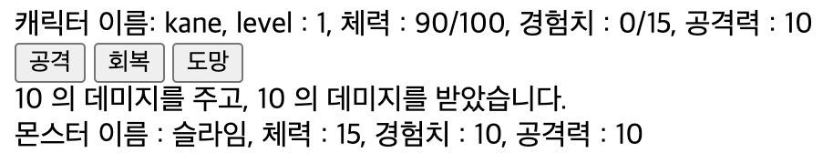

위의 사진은 전투모드에서 슬라임을 만나 공격 버튼을 클릭한 화면 입니다.
캐릭터가 얼마나 데미지를 주고 얼마의 데미지를 받았는지 메세지로 보여줍니다. 데미지는 hero, monster 의 공격력 입니다. 그리고 hero 와 monster 의 정보가 업데이트 되어 hero, monster 모두 체력이 10 감소한것을 확인할 수 있습니다. 

# 전투 모드에서 공격을 주고 받은 후 hero 가 승리 하였을때의 화면

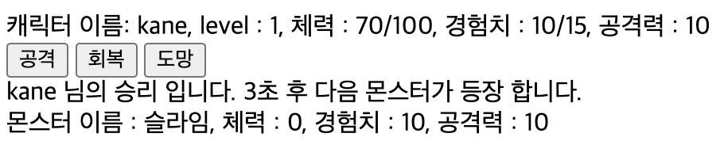

화면에 승리했다는 내용과 3초후에 다음 상대 몬스터가 등장한다는 메세지가 보여집니다. setTimeout 함수를 이용해서 3 초 후에 monster 새로운 객체를 생성 해 새로운 몬스터가 화면에 등장 합니다. hero, monster 의 정보가 업데이트 됩니다. 몬스터의 경험치를 얻었습니다. 

# 몬스터를 잡고 경험치를 얻어 레벨업 하는 화면

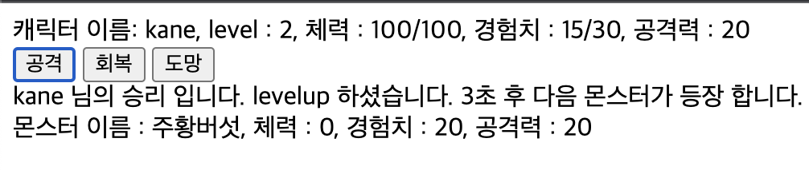

몬스터와 전투를 하다가 몬스터에게 승리해서 몬스터의 경험치를 얻어서 다음 레벨로 레벨업을 해야할때 필요한 경험치가 같거나 넘으면 레벨업을 하도록 코드를 작성 하였습니다. 레벨업을 하면 공격력이 10 씩 올라가고 체력이 다시 100으로 채워지며 다음 레벨로 레벨업을 하려면 얻어야 하는 경험치는 현재 레벨의 15 를 곱한 만큼 채워야 레벨업을 하도록 코드를 작성 하였습니다. 레벨업을 했다고 메세지를 보여 줍니다. 그리고 3초 후 다음 몬스터가 등장한다는 메세지와 힘께 3 초 후 새로운 몬스터가 등장 합니다. 

# 몬스터에게 패배한 화면

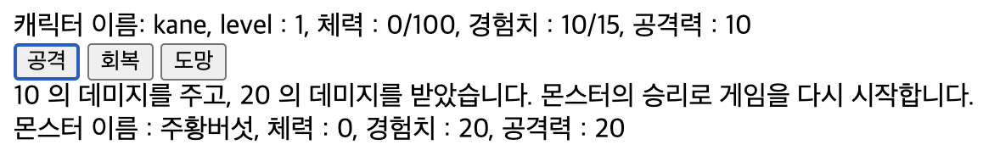

몬스터의 승리로 게임을 다시 시작한다는 화면이 보여지고 3 초 후 모두 초기화되고 시작 화면으로 돌아 갑니다.

# 전투모드에서 도망 버튼을 클릭

전투모드에서 도망 버튼을 클릭 한다면 화면에 전투 모드에서 도망 간다는 메세지와 일반 모드로 변경 된다는 메세지를 보여 줍니다. 일반 모드로 돌아가고 monster 의 객체는 null 로 날아가고 monster 의 정보를 보여주는 화면도 모두 초기화되서 화면에서 없어 집니다. 

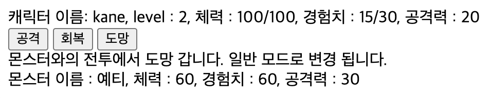

# 전투모드에서 회복 버튼을 클릭

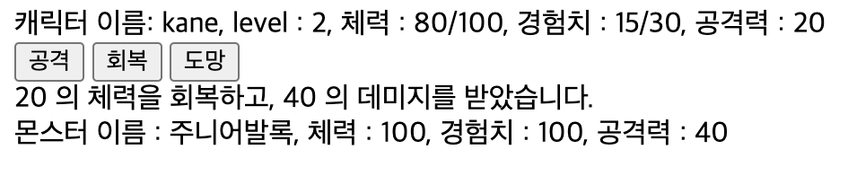

전투모드에서 회복 버튼을 클릭하면 hero 의 체력을 20 회복해주고 monster 의 공격력 만큼 공격을 당해서 체력이 줄어 듭니다. 이 내용을 메세지로 화면에 보여주고 hero 의 정보를 화면에 업데이트 해줍니다. 

# 텍스트 RPG 게임을 만들 때 정의한 클래스

 텍스트 RPG 게임은 game 객체 안에서 이벤트에 따라서 동작 합니다. game 객체 안에 Hero, Monster 클래스에서 생성한 객체인 hero, monster 객체 있고 그 객체들이 이벤트 발생에 따라서 상호 작용하며 게임이 진행된다. 각각의 객체에서 constructor 를 통해 어떤 프로퍼티를 가지는 객체가 생성되는지 설명 합니다. 

## 1. Game 클래스

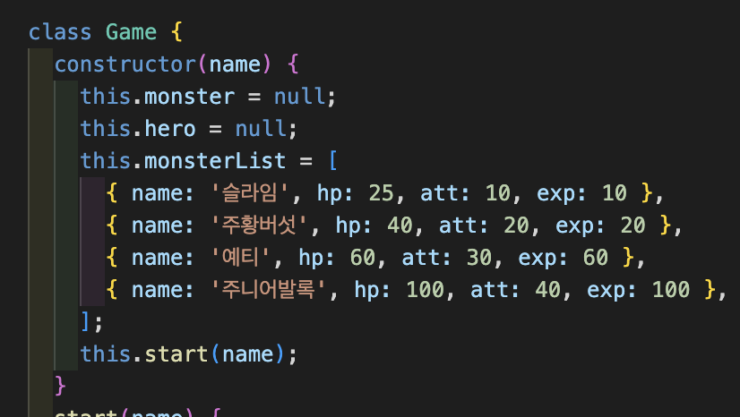

 위 코드가 Game 클래스의 constructor 에 작성되는 코드 입니다. new Game(입력한 캐릭터의 이름) 을 호출하여 객체를 생성 합니다. 객체의 프로퍼티에는 Hero, Monster 클래스에 의해서 생성된 객체가 hero, monster 프로퍼티의 값으로 저장 됩니다. 그리고 monsterList 프로퍼티는 monster 객체를 생성할 때 프로퍼티 값으로 사용됩니다. 

## 2. Hero 클래스

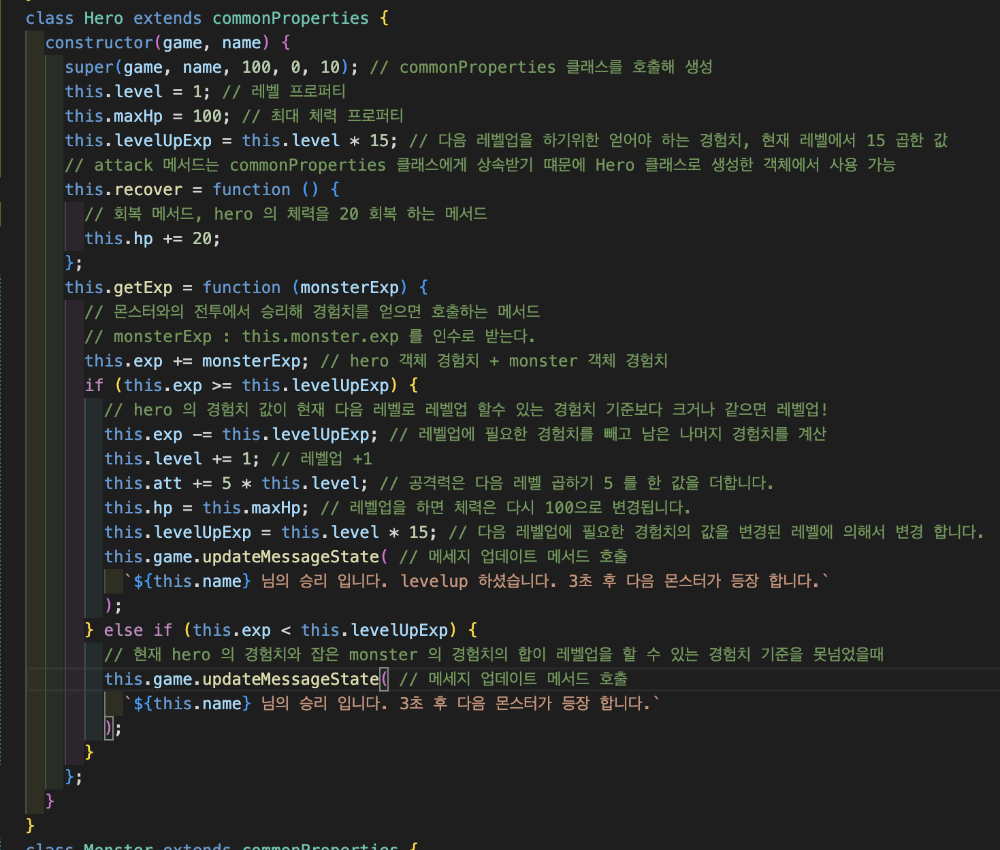

 위 코드가 hero 객체를 생성할때 사용하는 Hero 클래스 입니다. hero, monster 객체를 생성할때 공통되는 프로퍼티는 따로 commonProperties 클래스에 빼둬 상속을 받도록 코드를 작성 합니다. Hero 클래스에는 레벨, 최대체력, 레벨업에 필요한 경험치, 회복 메서드, 몬스터와의 전투에서 승리해서 경험치를 얻었을때 호출되는 메서드를 정의 합니다. 

## Monster 클래스

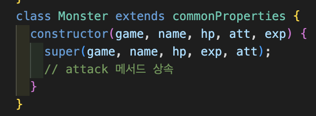

 위 코드는 monster 객체를 생성할때 사용하는 Monster 클래스 입니다. 모든 프로퍼티가 hero 와 공통되기 때문에 commonProperties 클래스를 상속 받습니다. 

## commonProperties 클래스

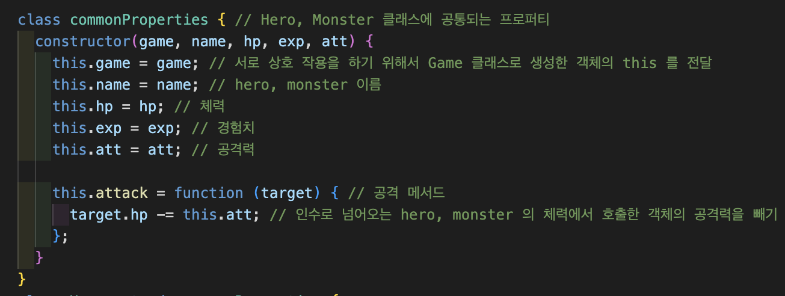

 위 코드는 hero, monster 객체를 생성할때 공통되는 프로퍼티를 따로 빼둬 클래스로 만들고 이 클래스를 Hero, Monster 클래스에 상속 합니다.
commonProperties 클래스에는 서로 상호 작용을 하기 위해서 Game 클래스로 생성한 객체의 this인 game, hero, monster 이름 name, 체력, 경험치, 공격력, 공격 메서드를 정의 합니다. 

# 텍스트 RPG 게임을 만들 때 생성한 메서드

텍스트 RPG 게임은 game 객체 안에서 hero, monster 의 객체가 이벤트가 발생하며 메서드가 실행되어 서로 상호작용하여 동작하는 프로그램 입니다. 간단하게 Game 클래스로 생성한 game 객체에 구성되는 메서드에 대해서 설명 합니다.
 

1. start : new Game(입력한 캐릭터의 이름) 으로 game 객체를 생성하면 자동으로 this.start(입력한 캐릭터의 이름) 으로 start 메서드가 호출 됩니다. start 메서드는 입력한 캐릭터의 이름으로 hero 객체를 생성하고 , hero의 정보를 화면에 업데이트, 일반 모드로 화면을 변경, 일반모드와 전투모드에서 버튼을 클릭해서 이벤트가 발생 할 수 있도록 addEventListener 을 달아 둡니다.  

2. changeScreen(screen) : 넘겨 받는 인수에 따라서 시작,일반,전투 모드로 화면을 변경해주는 메서드 입니다.  

3. updateHeroState() : 휴식, 공격, 회복 등의 버튼 클릭에 따라서 캐릭터의 hp(체력),exp(경험치),att(공격력),level(레벨) 등이 변경되는데 값이 변경되고 화면에 보여주는 메서드 , if 문을 사용해 hero 객체가 null 이라면 hero 객체의 모든 값을 날린 것인데 캐릭터가 전투를 하다가 몬스터에게 패배 했거나 종료 버튼을 클릭해 다시 시작 화면으로 돌아가야하는 상황으로 모든 정보를 화면에서 지우도록 합니다.  

4. updateMonsterState : 공격 버튼을 클릭하면 몬스터 정보의 변경을 화면에 보여주는 코드 입니다. if 문을 사용해 monster 객체가 null 이라면 monster 객체의 모든 값을 날린 것인데 몬스터가 캐릭터와의 전투에서 패배 했거나 도망 버튼을 클릭 했거나 종료 버튼을 클릭 했을때 모든 정보를 화면에서 지우도록 합니다.  

5. updateMessageState(text) : 전투 모드에서 전투, 회복, 도망 버튼을 클릭하면서 발생하는 결과를 문자열을 인수로 전달 받아 화면을 변경하는 코드 입니다.  

6. clickGameMenu : 일반 모드에서 버튼을 클릭했을때 호출되는 메서드, 클릭하는 버튼에 따라서 다른 메서드들이 호출됩니다.  

7. clickBattle : 일반 모드에서 모험 버튼을 클릭했을때 호출되는 메서드, 랜덤으로 monsterList 프로퍼티에서 하나의 몬스터 정보를 가져와 monster 객체를 생성하고 그 정보를 화면에 업데이트 해줍니다. 그리고 어떤 몬스터가 등장했는지 화면에 보여줍니다.  

8. clickReset : 전투에서 패배 했거나, 종료 버튼을 클릭해 모두 초기화하고 시작 화면으로 돌아갈때 호출되는 메서드 , game, hero, monster 객체를 모두 null 로 날려 버리고 화면에 보여지는 모든 정보를 지워버리고 시작 화면으로 변경 됩니다.  

9. clickRun : 도망 버튼 클릭 했을 때 호출되는 메서드, 몬스터에게 패배 또는 종료 버튼을 클릭 했을 때와 다르게 monster 객체만 null 로 날려 버리고 monster 의 정보만 화면에서 지워 버리고 일반 모드로 변경 됩니다.  

10. clickBattleMenu : 일반 모드에서 모험 버튼을 클릭해 전투모드에서 공격, 회복, 도망 버튼을 클릭해 위에서 정의한 메서드들을 호출하며 게임을 흐름을 진행하는 메서드 입니다.  

# 텍스트 RPG 게임을 만들때 꼭 알아야될 지식들

## window 객체

window 객체는 브라우저를 가리키는 객체 입니다. 브라우저가 제공하는 제공하는 기본 객체와 함수들은 대부분 window 객체 안에 들어 있습니다, document, console 객체 등이 window 객체 안에 있는 객체 입니다. 기본적으로 this 는 window 객체를 가리킵니다. 그래서 객체 메서드에서 내부 함수를 만들어 this 를 사용하면 this 는 전역객체 즉 window 객체를 가리킵니다. 

# 얕은 복사, 깊은 복사

게임에서 monsterList 프로퍼티 값인 배열 안에 있는 몬스터 정보가 담긴 객체를 가지고 올때 그 객체를 복사해야 합니다. 복사하지 않으면 그 객체의 프로퍼티 값을 변경하기 때문에 다음에 또 그 객체를 사용할때 몬스터의 프로퍼티 값이 변경되어 있을 겁니다. 그것을 방지하기 위해서 monsterList 에 저장되어 있는 객체를 가지고 오는 것이 아니라 객체 정보만 가져와 monster 객체를 생성 합니다. 그럼 복사에 대해서 알아봅시다.  
복사는 얕은 복사와 깊은 복사가 있습니다.  
얕은 복사는 바깥 객체만 복사되고 내부 객체는 참조가 되는 복사 입니다. 원시 값은 복사가 됩니다. 그렇기 때문에 얕은 복사를 한 후 참조되는 값인 객체, 배열 등의 프로퍼티를 변경하면 복사를 해준 객체와 복사를 받은 객체의 프로퍼티 값이 모두 변경되는 일이 발생합니다. 대부분의 경우는 얕은 복사로 해결 되지만 객체 안에 객체, 배열이 있고 기존의 객체 프로퍼티 값은 변경을 원하지 않는다면 깊은 복사를 사용해야 합니다. 
얕은 복사를 하는 방법은 배열로 예를 들면 [...복사할 배열], slice 메서드를 사용하면 얕은 복사를 할 수 있습니다. 
깊은 복사는 객체 자체를 모두 복사하는 복사 입니다. 단점은 성능도 느리고 함수나 Math, Date 같은 객체를 복사할 수 없다는 단점이 있습니다. 실무에서는 lodash 같은 라이브러리를 사용 합니다. 
사용하는 문법은 JSON.paese(JSON.stringify(복사할 대상)) 입니다. JSON.stringify 로 JSON 형태로 복사후 다시 parse 로 객체 형태로 변경하는 방법 입니다.

# this

 this 는 상황에 따라 다른 값을 가리킵니다. 기본적으로 this 는 window 객체를 가리키며  객체를 통해서 this 를 사용할때는 this 는 해당 객체를 가리킵니다. 하지만 해당 객체에서 정의 되어 있는 메서드 안에서 this 를 사용한다고 하더라도 그 메서드를 다른 객체에서 호출하면 그 this 는 호출한 객체를 가리킵니다. this 는 호출한 객체에 따라서 달라집니다.  
특정 메서드는 콜백 함수의 this 를 변경하는데 이것은 그 함수를 호출한 태그가 콜백함수의 this 가 되는 것 입니다. 대표적으로 addEventListener, setTimeout 메서드가 있습니다. 만약 이러한 메서드에서 호출한 콜백함수 내에 this 를 콜백함수를 정의한 객체를 가리키도록 하려면 콜백 함수를 화살표 함수로 정의하면 된다. 화살표 함수에는 this 가 없고 화살표 함수의 this 는 화살표 함수를 정의한 상위 객체를 가리키기 때문이다.

 this 는 메서드를 호출할때 결정이 된다. 

# 클래스

클래스는 객체를 생성하기 위한 템플릿 입니다. 그전에는 생성자 함수나 팩토리 함수로 객체를 찍어냈다. class 예약어로 클래스를 선언하고 constructor 메서드 안에 기존 코드를 넣습니다. new 를 붙여 호출하면 constructor 함수가 실행되고 객체가 반환 됩니다. this 는 생성된 객체 자신을 가리키게 됩니다.
클래스의 좋은점이 객체를 생성할때 new 를 안붙여주면 에러가 발생합니다.

# 클래스 상속

클래스끼리 extends 예약어로 상속할 수 있습니다. 상속하는 클래스는 부모 클래스가 되고 상속 받는 클래스는 자식 클래스가 됩니다. 공통되는 속성이나 메서드는 부모 클래스로부터 상속 받습니다. 상속받은 클래스에서 부모 클래스 생성자를 호출할때는 super 을 사용 합니다. 자식 클래스에서 super 함수는 부모 클래스를 의미하며 부모 클래스의 생성자에 인수를 전달하여 호출 합니다. 자식 클래스에는 공통되지 않은 속성을 선언 합니다. super.메서드를 호출하면 부모 클래스의 메서드를 호출 할 수 있습니다. 

 hero 와 monster 클래스에서 공통되는 부분만 추려 새로운 클래스로 만들고 hero 와 monster 클래스는 이 클래스를 가져와 사용할 수 있습니다. 이것을 상속 이라고 합니다. 

# 게임을 만들면서 궁금했던 것 : 클래스를 선언하고 정의할때 메서드를 constructor 에 정의하는 것과 클래스 내에 정의하는 것은 뭐가 다른가?

 클래스를 선언할때 constructor 밖에 메서드를 정의하면 일반적인 메서드는 prototype 에 저장되고 화살표 함수로 정의한 메서드는 클래스로 객체를 생성하면 객체 내의 프로퍼티로 할당 됩니다. 그 이유는 화살표 함수여서가 아니라 선언 방식이 public instance field 로 인식되었기 때문입니다. 

