# 틱택토 게임

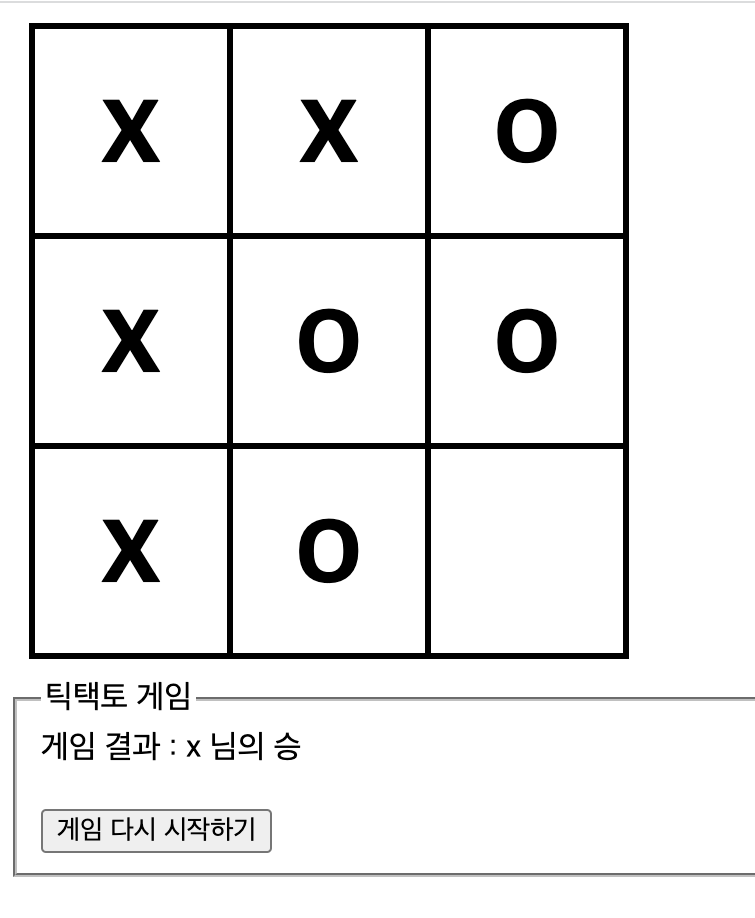

## 틱택토 게임 순서도

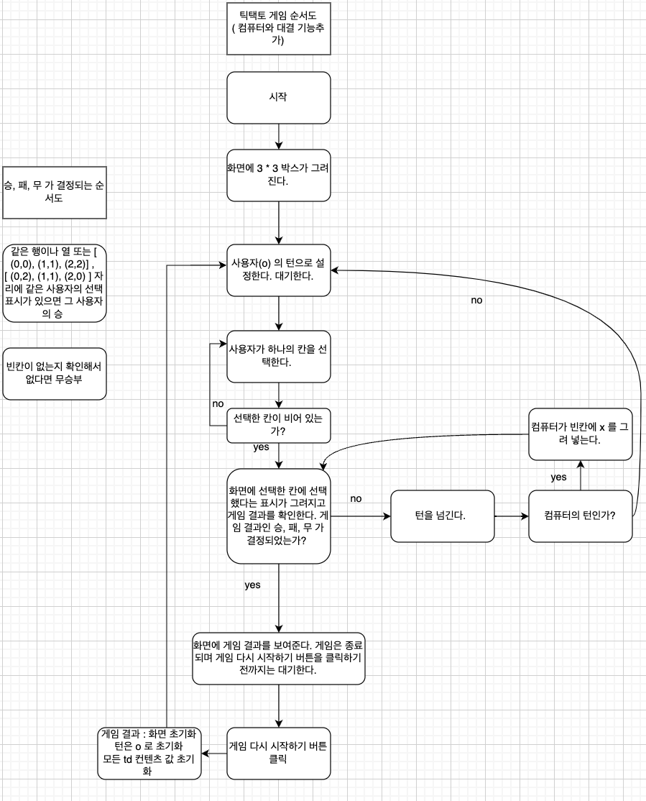

## 틱택토 게임 구현

 틱택토 게임은 3*3 구조의 빈칸에 2명의 상대가 돌아가면서 그림을 그려 한줄이 먼저 나온 사람이 승리하는 게임 입니다. 쉽게 말해서 오목을 삼목으로 하는것과 같습니다. 게임이 진행되는 동안 한번 선택한 빈칸은 다시 선택하지 못하게 만들고 게임이 끝나면 게임 다시 시작 버튼을 클릭해야 새롭게 다시 시작 할 수 있도록 만들었습니다.

# 틱택토 게임을 구현할때 사용한 것들

## 이벤트 버블링

이벤트가 발생할 떄 부모 태그에도 동일한 이벤트가 발생하는 현상을 이벤트 버블링 이라고 한다. 이벤트 버블링 현상이 일어나면 이벤트 리스너 콜백 함수의 event.target이 이벤트가 발생한 태그로 바뀌므로 주의해야 한다.이벤트가 발생한 태그가 아닌 이벤트 리스너 함수에 연결한 태그에 접근하고 싶다면 event.currentTarget 을 사용하면 된다. 이벤트 버블링을 이용하면 여러개의 이벤트를 달아줘야 할것을 부모 태그에 달아줘서 한번만 이벤트를 달아줄 수 있게 된다. remove 리스너를 달기 편하다.

상위 태그에 이벤트 리스너를 달고 하위 태그에 이벤트 발생시 상위 태그의 이벤트 리스너 동작

## 이벤트 캡쳐링

하위 태그에 이벤트 리스너를 달고 상위 태그이 이벤트 발생시 하위 태그의 이벤트 리스너 동작

## flat()

배열을 한차원씩 낮춰 만들어준다.
예를 들어 2차원 배열이라면 1차원 배열로 만들어준다.

## every 메서드

배열 안의 모든 요소가 인자로 전달되는 함수에 모두 true를 반환해야 true 를 반환하고 아니라면 false를 반환합니다. 인자로 전달되는 함수는 화살표함수, 콜백함수등이 가능합니다.
인자로 전달되는 함수의 인자로는 (배열에서 처리되는 현재요소, 현재 요소의 인덱스, every를 호출한 배열) 순서대로 전달할 수 있습니다.

## some 메서드

배열 안의 모든 요소가 인자로 전달되는 함수에 하나라도 true를 반환해야 true를 반환하고 아니라면 false를 반환합니다.
인자로 전달되는 함수의 인자로는 (배열에서 처리되는 현재요소, 현재 요소의 인덱스, every를 호출한 배열) 순서대로 전달할 수 있습니다.

# 현재 클릭한 칸의 위치를 알아내는 코드

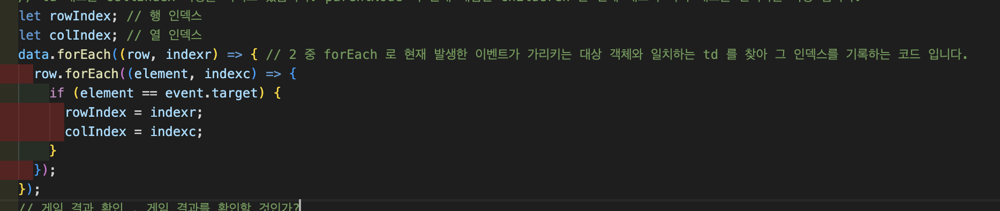

 위의 코드는 forEach 를 이용해서  현재 발생한 이벤트가 가리키는 대상 객체와 일치하는 td 를 찾아 그 인덱스를 기록하는 코드 입니다. 하지만 태그 프로퍼티에 대해서 잘 알면 forEach 로 태그 하나하나 확인할 필요가 없습니다. 

 위의 코드로 사용자가 클릭한 태그인 td 의 위치 인덱스를 알아낼수 있긴 합니다. 하지만 이렇게 하나하나 확인하는것은 어쩔수 없는 상황이면 이렇게 코드를 작성할수 밖에 없지만 더 유용한 방법이 있다면 그 방법이 더 좋은 방법이 될 것 같습니다. 그 방법은 바로 태그 프로퍼티를 이용하는 방법 입니다. 
let rowIndex = event.target.parentNode.rowIndex;  
let colIndex = event.target.cellIndex;  
코드로 대체할 수 있습니다. parentNode 는 현재 태그의 부모 태그를 선택하는 속성이며 현재 태그는 td 니까 부모 태그는 tr 태그로 tr 태그는 rowIndex 속성을 가지고 있습니다.
td 태그는 cellIndex 속성을 가지고 있습니다. parentNode 의 반대 개념인 children 은 현재 태그의 자식 태그를 선택하는 속성 입니다.

# 게임 결과 판단하기

빈칸이 모두 선택되지 않아도 한줄이 만들어지면 게임은 종료가 됩니다. 그래서 빈칸을 선택할때마다 승자가 결정되는지 또 빈칸이 모두 선택되었는데 승자가 결정되지 않으면 무승부가 된것을 알려줘야 합니다.

게임 결과를 어떻게 어떤 조건으로 확인할 것인가?  
1. 같은 행 또는 같은 열이 모두 같은 사용자가 클릭 하였을때  
2. (0,0), (1,1), (2,2) 을 같은 사용자가 클릭 하였을때, 대각선  
3. (0,2), (1,1), (2,0) 을 같은 사용자가 클릭 하였을때, 대각선  
그럼 어떻게 이 조건들을 확인할 것인가? 

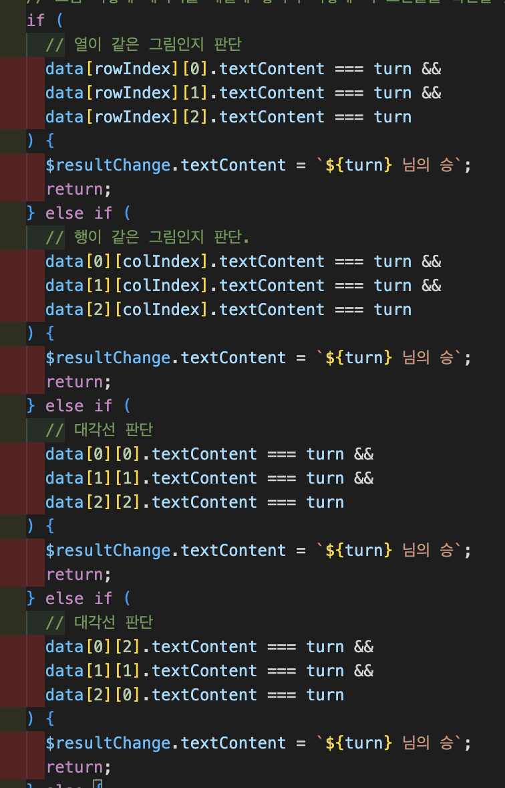

위에서 현재 클릭한 위치를 알아 냈으니 그 위치의 같은 행의 그림이 현재 클릭한 위치의 그림과 같은지 또는 같은 열의 그림이 현재 클릭한 위치의 그림과 같은지 비교하고 나머지 대각선이 같은지 if 문으로 판단 합니다. 만약 그 중에서 if 문 true 가 나온다면 승자를 화면에 보여주고 return 문으로 게임을 종료합니다. 아래 코드는 확인할 필요가 없기 때문 입니다.  그럼 이제 무승부는 어떻게 판단할까요? 무승부가 되기 위해서는 모든 빈칸이 선택되어 그림이 그려졌는데 같은 그림으로 한줄이 만들어지지 않아 승자가 결정되지 않을때 입니다. 빈칸을 선택했을때 매번 무승부인지도 확인해야 하기 때문에 9칸을 모두 확인해 그림이 그려졌는지 확인해야 합니다. 

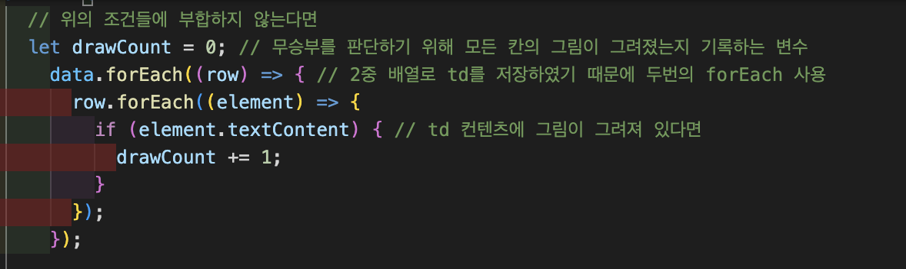

위의 코드와 같이 td가 2중 배열로 data에 저장되어 있기 때문에 forEach를 사용하여 각각의 td 에 그림이 그려져 있는지 확인하고 그림이 그려져 있다면 그것을 기록할 drawCount 변수의 값을 +1 합니다.

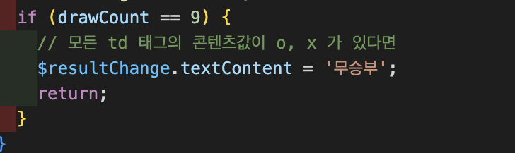

그 후 위의 코드로 drawCount 값이 9 라는 것은 9개의 td 태그에 o, x 가 그려져 있다는 뜻이니까 게임 결과를 무승부로 화면에 보여 줍니다. 그리고 return 으로 게임을 종료 합니다. 게임의 결과가 결정 되었으니 더이상 어떤 동작을 할 필요가 없기 때문이죠.

## 게임 결과 판단하기 또 다른 방법

내 개인적인 생각에는 빈칸을 모두 선택 했는데 승자가 나오지 않아 모든 td의 컨텐츠 값을 확인해 그림이 그려져 있는지 확인하는 것은 어쩔수 없지만 그 외에 상황에서 선택되지 않은 빈칸이 있을텐데 굳이 모든 빈칸을 확인하는것은 비효율적이라는 생각이 들었습니다. 그레서 코드를 변경해 보았습니다.

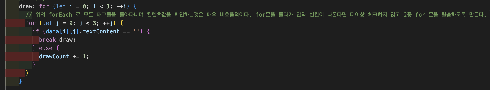

위의 2중 for 문으로 하나하나의 td를 확인해주다가 그림이 그려져 있지 않은것이 확인되면 label 을 이용해 for 문을 탈출하는 코드를 작성해 보았습니다. 사실 이 코드도 생각해보면 제가 배열의 구조를 알고 있기 때문에 일반적인 2중 for문을 사용한거지 만약 배열의 요소가 몇개인지 모르고 있다면 이 방법은 사용할 수 없을 것 같습니다.   근데 제로초님의 강의를 듣다가 또 다른 방법도 알게 되었습니다.   바로 every 메서드를 이용하는 것 입니다. 이 메서드는 true, false 를 반환한다.  
let drawCount = data.flat().every((element)=>element.textContent) 코드를 이용해 모든 td의 컨텐츠값이 있어서 true로 반환되면 메서드가 true가 반환되어 그 결과로 모든 td 의 콘텐츠 값이 있는지 없는지 확인할 수 있는 코드였습니다.

## 턴 바꾸기

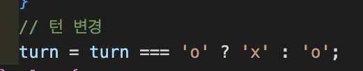

빈칸을 선택할때마다 위의 승자 조건에 포함되지 않는다면 위의 코드와 같이 삼항 연산자를 이용해 빈칸을 선택할 턴을 변경해 줍니다.

## 게임 종료

게임이 종료되면 게임 다시 시작하기 버튼을 클릭하기 전까지는 대기 상태가 되어야 합니다. 그래서 게임 결과가 화면에 보여준 이후에 td 태그를 클릭하게 되면 이벤트가 발생해서 clickBlock 콜백 함수가 호출되지만 코드 가장 위에 if 문으로 화면에 게임 결과가 있다면 함수가 return 으로 종료되도록 코드를 작성하였습니다. 게임 다시 시작하기 버튼을 클릭해 clickReset 콜백 함수가 호출되어야 화면에서 게임 결과가 지워 집니다.

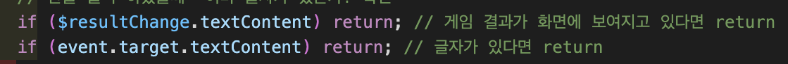

위의 코드처럼 이미 게임 결과가 화면에 보여졌거나 빈칸에 그림이 그려져 있는 상태면 클릭해도 clickBlock 함수가 종료된다.

## 컴퓨터와 대결 기능 추가, o 턴의 사용자가 빈칸을 선택한 후 컴퓨터가 빈칸을 선택하는 사이에 중복 클릭 제거하기

기존에 제가 만든 게임은 제가 혼자 o,x 턴을 선택하는 게임 이였습니다. 역시 그럼 재미가 없죠. 컴퓨터와 대결하는 기능을 구현해 보았습니다. 기존에 저는 빈칸을 클릭하면 이벤트가 발생해 clickBlock 함수가 호출되도록 콜백 함수를 만들었고 그 안에 빈칸에 그림을 그려주는 코드, 승자와 무승부를 판단하는 기능, 턴을 변경하는 기능을 모두 하나의 함수에 작성하였습니다. 제가 컴퓨터와 대결 기능을 추가하면서 턴이 x 라면 랜덤으로 빈칸중에 하나를 골라 빈칸에 x 를 그리고 게임 결과가 승과 무승부가 아니라면 턴을 o 으로 변경해줘야 했습니다. 결론적으로 빈칸을 선택 후 o, x 턴 모두 승자와 무승부 판단과 턴을 변경해주는 코드가 중복되기 때문에 승자와 무승부 판단과 턴 변경 코드는 아예 o,x 턴일때 모두 다른 함수로 빼서 호출하는 방법을 선택 했습니다.   승자와 무승부 판단과 턴 변경 코드는 winOrDraw 함수에 넣어 승이나 무승부라면 true 로 반환하고 winDraw 함수를 종료하도록 하였습니다. 반환 값을 리턴하고 종료하는 이유는 게임 결과가 결정되었는지도 반환 값으로 알아야하고 게임 결과가 결정되었으면 그 이후 코드인 턴을 바꾸는 코드는 게임이 종료되었기 때문에 실행될 필요가 없기 때문입니다.

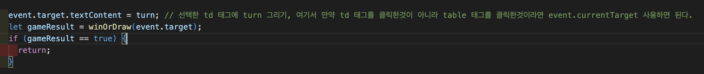

위의 코드와 같이 turn 이 o 일때 td 태그를 클릭하면 빈칸에 o 을 그리고 winDraw 함수를 호출하여 반환 값을 받아 반환 값이 true 라면 return으로 clickBlock 함수가 종료되도록 하였습니다. 이렇게 코드를 작성한 이유는 반환값이 true 라면 이미 게임이 종료되었기 때문에 컴퓨터 (x 턴) 가 선택할 필요가 없어지기 때문입니다. 

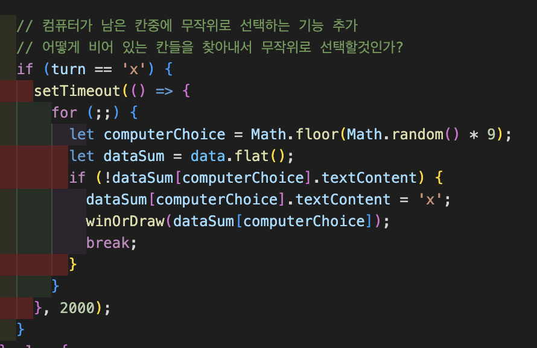

위의 코드는 winOrDraw 함수의 반환값이 true가 아니기 때문에 게임이 종료되지 않았고 컴퓨터의 턴으로 변경 되어 랜덤으로 빈칸인 td 를 찾아 x 를 그리고 winDraw 함수를 호출해 게임 결과와 턴을 변경하는 코드 입니다. 직접 게임을 실행해보니 제가 빈칸을 선택하자마자 컴퓨터도 선택되서 재미가 없어 setTimeout 메서드를 이용해 2초 후에 컴퓨터의 선택이 실행되도록 코드를 작성하였습니다. 이때 o 턴인 사용자가 빈칸을 선택한 후 컴퓨터가 랜덤으로 빈칸을 선택해 td 에 그림을 그리고 winOrDraw 함수가 호출되고 게임결과까지 판단을 마칠때까지 setTimeout 메서드가 종료될때까지 o 턴인 사람은 빈칸을 선택할 수 없도록 해야 합니다. o 턴인 사용자가 중복선택을 하게되면 원하지 않는 결과가 나올것 입니다. 그래서 clickBlock 함수가 호출되면 일단 게임 결과가 이미 화면에 보여지는지 또는 빈칸이 아닌 칸을 선택 했는지 확인 후 removeEventlistener 로 td 태그가 이벤트를 읽지 못하게 하고 컴퓨터의 빈칸 선택이 끝나면 addEventlistener 로 다시 td 태그의 클릭 이벤트를 읽을 수 있도록 합니다.  제로초님의 강의애서는 clickable 이라는 변수를 선언해 값이 true 일때만 클릭할 수 있도록 하고 컴퓨터 턴일때는 false로 변경해 클릭 못하게 하고 setTimeout 함수가 종료될 때 다시 true로 변경해 클릭할 수 있도록 하는 방법을 사용 하셨습니다.  그리고 게임이 종료된 후에 게임 다시 시작하기 버튼을 클릭하면 호출되는 콜백함수 clickReset 함수에서 addEventlistener 로 다시 td 태그의 클릭 이벤트를 읽을 수 있도록 해줘야 합니다. 그 이유는 턴이 o 일때 빈칸을 선택하고 게임 종료가 되면 턴이 x 로 넘어가지 않기 때문에 이벤트를 읽지 못하는 상태로 되어 있기 때문입니다.  

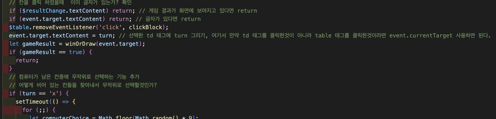

위의 코드와 같이 removEventListener 로 컴퓨터가 선택하기 전까지 중복 선택을 할 수 없도록 이벤트를 제거 해줘야 합니다.

## 컴퓨터가 랜덤으로 빈칸을 선택해 x 그리기

위의 코드를 보면 0부터 8까지 랜덤으로 숫자를 받아 그 인덱스 값으로 빈칸인지 확인해 빈칸이 아니라면 다시 랜덤 숫자를 받는 방법으로 무한반복해서 빈칸이라면 빈칸에 x 를 그리고 winOrDraw 함수를 호출하는 방식으로 코드를 작성하였습니다.. 근데 매우 비효율적인 방법인 것 같습니다.. 빈칸을 찾을때까지 무한 반복하는것이기 때문입니다. 제로초님의 강의에서 좋은 방법을 찾았습니다. 바로 filter 메서드를 사용해 빈칸인 td 만 골라내서 그 배열 안에서 무작위로 뽑아 x 를 그리는 방법 입니다.

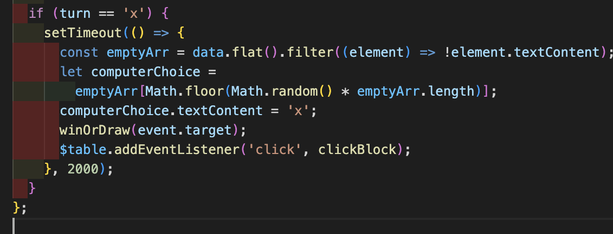

위의 코드와 같이 빈칸인 칸들을 찾아내 그 안에서 무작위로 뽑아 x 를 그리는 방식으로 코드를 작성하였습니다.

